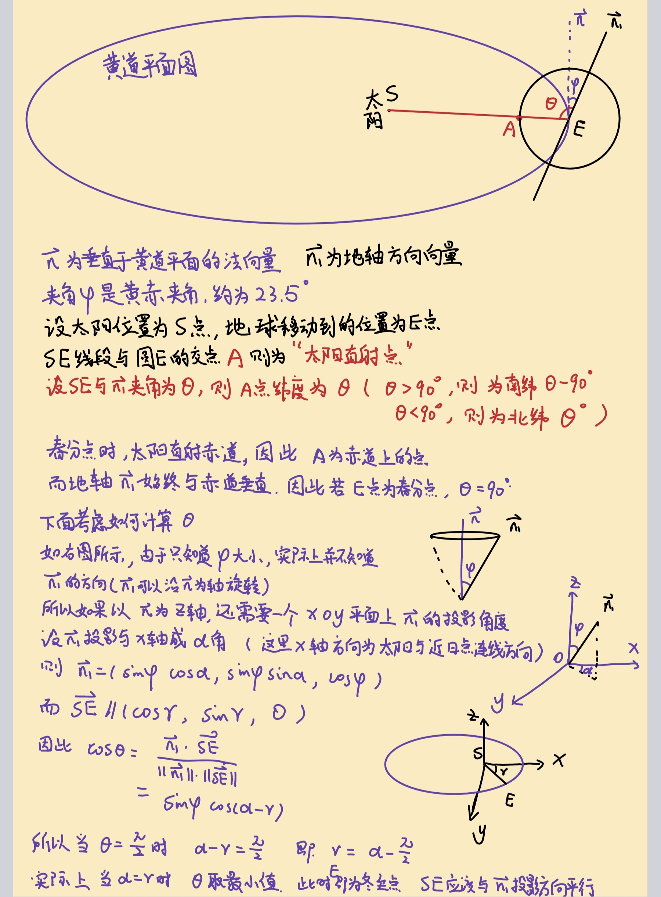
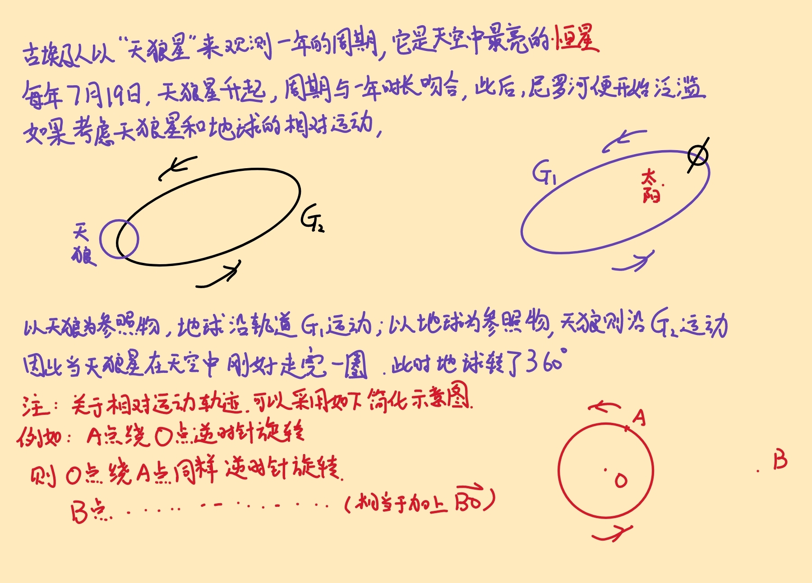

## 日期 3.22

## 知识学习 
### 专业知识 
+ **地球的运动**
	+ <mark>春分点的计算</mark>
	 >春分点的位置实际上是由地轴在黄道平面上投影的角度$\alpha$决定的，当日地连线平行于该投影方向是，则为**两至点**（冬至、夏至），若垂直于该方向，则为**两分点**（春分、秋分）  实际上，两至点的连线和两分点的连线互相垂直，交点即为太阳。
		  下面是详细推导图：
	
	
		
	
	 + <mark>地轴的运动</mark>
	 
		 + 地轴进动  
   https://baike.baidu.com/item/%E5%9C%B0%E8%BD%B4%E8%BF%9B%E5%8A%A8/8391122
 地轴实际上并非固定不动，而是沿着黄道平面的法向 $\vec{n}$ （也称为**黄极**）转动的，以 $23^{\circ}26'$ 为半径做圆周运动，转动的速度为每年向西转动 $59.29''$，周期是25800年。
			 地轴的这种转动称为**进动**，具体形成原因及细节，参考上述链接。
			 
		 + 章动  
		https://baike.baidu.com/item/%E7%AB%A0%E5%8A%A8/695762?fromModule=lemma_inlink   
			 章动实际上是由月球所导致的。由于月球在白道上运行，黄白交角平均为5°9′，也就是说，月球经常位于黄道的上面或者下面，因此会对地球产生不同方向的引力，导致地轴与黄极角度的微小变化，不断在其平均位置（$23^{\circ}26'$）上下做周期性的微小摆动。  
			 这种摆动称为**章动**，振幅约9″，周期为18.6年。章动使得地轴绕黄极的旋转并非精准的圆周运动，而是呈现波纹状的圆周运动。  
			 
			 
		 + 极移  
		  https://baike.baidu.com/item/%E6%9E%81%E7%A7%BB/2381678?fromModule=lemma_inlink
		  地球自转轴相对于地球本体的位置是变化的，这种运动称地极移动，简称**极移**。
		  极移机制的因素包括太阳、月球引力和大气、海洋等的作用，也涉及地球内部结构的各种理论模型。具体成因参考上述链接。
		  极移会导致地球北极点和南极点的位置发生改变，从而使地面上各点的纬度、经度和方位角都发生变化。实际上，人们正是通过观测地球上某位置的纬度变化，才观测到极移现象的。
			>为什么某地北极星的仰角度数高度等于当地的地理纬度? 
	    
				 根据这个原理，当北极星仰角改变时，说明该点的纬度也发生了改变。  
				 注意：赤道上看不到北极星。
				 
		>**总结：  
			1. 地轴进动不影响黄赤夹角，只影响地轴在黄道平面上投影的角度，是影响春分点西移的主要原因。  
			2. 章动影响黄赤夹角，会使得春分点在黄道上的位置和黄赤交角对于各自的平均位置产生周期性的振荡，振幅分别可达17''2和9''2。因而使得天体的坐标如赤经、赤纬等都发生变化。  
			3. 极移是地轴相对地球自身位置发生的变化，与黄道没有关系，范围在$\pm 0.4''$。**
		
	 + <mark>春分点西移</mark>  
		 春分点西移又叫春分点退行主要原因是地球自转轴的进动和章动以及其他行星对地球轨道的摄动综合造成的影响。其中进动使得春分点退行，章动使得春分点东西震荡，行星摄动使得春分点东移，综合起来造成春分点西移的现象。		
		> 问题1：春分点西移会导致将来某一时刻春分点移动到近日点附近吗？  
		答：会。
		说明：在大约1.2万年前，近日点位于夏至前后。公元1240年前后，近日点刚好和冬至日重合，现在已经移动到冬至之后约两周；再过约4500年，近日点将移动到春分日前后。<a id ="01-1">[跳回](#01-2)
		具体参考链接：  
		https://m.weibo.cn/detail/5119048210186857   
		 问题2：春分点的回归周期是多久?  
		答：显然是跟地轴进动周期近似一致，约为25800年。实际上，从上面的数据：近日点1.2万年前到夏至点，1240年到冬至点，大致可以推出，周期 $$T \approx 2 \times (12000+1240) \approx 26000（\text{年}） $$
		
	 
	
	 + 

	+ <mark>恒星年、回归年和近点年</mark>  
		+ 恒星年   
		恒星年，是指地球绕太阳一周，也即 $360^{\circ}$ 实际所需的时间间隔。通常以遥远恒星背景（如角宿一、轩辕十四）观测太阳的位置周期性回归来确定，近似每年西移 $1^{\circ}$（注意：这是在银河系背景下，通过天文望远镜观测太阳，而不是通过在地球看天空上太阳和恒星的相对位置来观测 ），由于地球公转轨道为逆时针的椭圆，所以这颗恒星在地球天空上观测的轨道也是逆时针的椭圆。当该恒星两次经过轨道同一点时，之间的时间间隔，称为恒星年。
    	
	    			https://baike.baidu.com/item/%E6%81%92%E6%98%9F%E5%B9%B4/490640   
		https://baijiahao.baidu.com/s?id=1822483755860205653&wfr=spider&for=pc
		+ 回归年  
		这是地球公转的春分点周期，其时间长度为365.24219879日。在一个回归年期间，从太阳中心或地球中心看，地球（或太阳）中心连续两次过春分点。在一个回归年内，地球围绕太阳公转的角度略少于360度，为359度59分59秒740毫角秒。
		+ 近点年  
		地球中心连续两次经过轨道上的近日点（离太阳最近的点）或远日点（离太阳最远的点）的时间间隔定义了一个近点年，这个时间长度为365.25964日。
   >  说明 
### 生活常识 
+ 手指手套
### 求职 

## 心得 
### 学习心得 
+ 
### 生活技巧 

### Good Idea 

## 新名词 
### 英文单词 
### 新词 

## 各类网站 

## 资源文件 

## 新闻 

## 新知 
+ 

## 待办事项 
### 事项 
- [ ] ...
### 已解决 
### 疑问 
- [ ] ...
### 明日计划 
- [ ] ...

## 备注 
  1. **近日点也会变化么？一些地理或天文书籍上写，近日点在1月3日或4日？**
	的确会。日期变动存在两种原因：一种是在数年到十余年范围内，地轴因月球引力等引起的“短时间”章动，它的影响周期性较明显但幅度很小，大约会影响2-3天的日期变动。
	但更大的原因是地轴进动引发的岁差。这个岁差，来自地球真正公转一周的恒星年时长，长于两次春分点间回归年时长（后者也是公历规定的“一年”长度）。这在黄道上表现为春分点的西移，但在公历历法上，表现为近日点日期逐渐推移，周期约2.1万年。这表明，每过五十多年，近远日点就后移一天。公元1240年前后，近日点刚好和冬至日重合，现在已经移动到冬至之后约两周；再过约4500年，近日点将移动到春分日前后。 
	这会造成什么气候影响呢？如果近远日点与黄赤交角造成的季节配合时，影响就较为明显了；如果再考虑离心率变化导致的日地距离变化，影响会更重要。
	在大约1.2万年前，近日点位于夏至前后，此时北半球夏季更暖，这对较敏感的北半球高纬度冰雪影响很大，有利于其出现更显著融化；而冰雪融化后，更暗的陆地与海洋表面会吸收更多热量，从而形成温度进一步升高、加速冰雪融化的正反馈循环，并引发后续气候效应。多数研究认为，这与全新世大暖期的开端密切相关。  <a id ="01-2">[跳回](#01-1)
<!--stackedit_data:
eyJoaXN0b3J5IjpbLTI3NzMzNDIzMiwtMjEwNDI4MjE3MywxMD
A1ODE4MDUwLDg0NzIwMjg3NCwzNDIzNzI0NjIsMTQ1OTMyNDMx
MCwtMTAwNjkxMzY5MywtODc5NzgwNzg2LDUyOTI0ODcxMCwxMT
k4NjYwNzIsLTE0OTcyNTUxODksLTExODIyNTc5OTMsMTY5MTc5
NzA5NywtMjAwMjcxODQwOCwtMTUxNzk4NzAzMCwtMTQ1OTI0ND
QwNSw0MTg4NzA1MSw0NjE3MjUyMzUsLTE1NDIxNjQ1ODQsMTA2
OTY2Mjk3NV19
-->