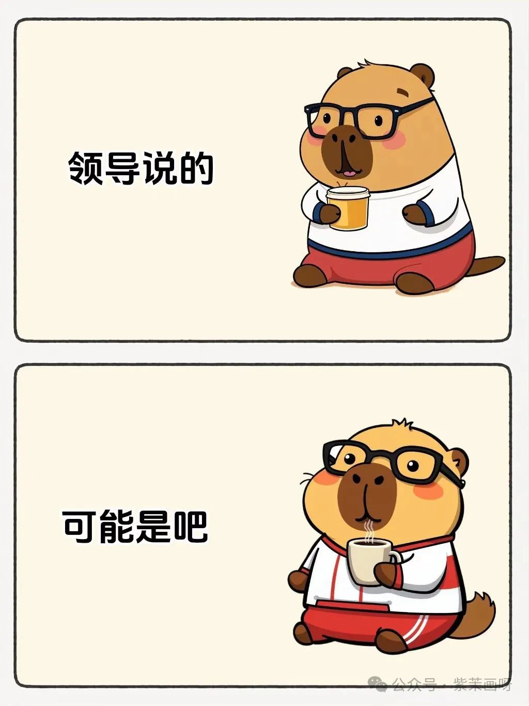

## <font color = blue face=楷体 size=6>日期 4.01 </font>

## <font color = green>知识学习 </font>
### <font color = purple>专业知识 </font>
+ 
   > <font color = o> 说明 </font>
### <font color = purple>生活常识 </font>

### <font color = purple>求职 </font>


## <font color = green>心得 </font>
### <font color = purple>学习心得 </font>
+ 
### <font color = purple>生活技巧 </font>

### <font color = purple>Good Idea </font>


## <font color = green>新名词 </font>
### <font color = purple>英文单词 </font>
### <font color = purple>新词 </font>


## <font color = green>各类网站 </font>
#### 免费生成AI图片的网站，支持api
[Pollinations.AI](https://pollinations.ai/)

## <font color = green>资源文件 </font>
#### 《高等代数典型问题与方法》——樊启斌，2021
+ 文件来源：安妮的档案
+ 答案来源：输入网址，在不登陆的情况下，用kb浏览器嗅探图片资源文件（要等一下）。
+ 答案整合：下载的图片都是被切割的，所以需要把图片拼在一起。
	首先根据章节和题号放在不同的章节文件夹中，然后注意到有的图片有页码，并发现规律，每三张图片拼成

## <font color = green>新闻 </font>
#### 打工人只需四个字就能平息职场矛盾？？ <a id = "02-1">  [<font color = red>跳转</font>](#02-2)
https://mp.weixin.qq.com/s/bIB0NLutNSFrJNdYjKe83w

## <font color = green>新知 </font>
#### 让Deepseek生成AI图片的方法  <a id = "01-1">  [<font color = red>跳转</font>](#01-2) 
https://mp.weixin.qq.com/s/6PYWkNUYvmCOZ5rUncuDyQ  
	原理：Deepseek自身是无法产图的，只能产生文本。于是通过DeepSeek生成AI提示词，然后借助“Pollinations”的AI绘图平台，将提示词补充进图片的url中，最后按照Markdown格式展示图片。
```
	
```
其中 {description} 的格式为:
```		
{sceneDetailed}%20{adjective}%20{charactersDetailed}%20{visualStyle}%20{genre}%20{artistReference}
```
由于这个网站提供了直接把绘图描述语放在网址中这一能力，所以通过浏览器地址栏就能无限绘图了。
```
https://image.pollinations.ai/prompt/描述语
```
注意：“Pollinations”是国外的平台，用的是FLUX绘图大模型，可能默认画出来的风格和我们审美有一定区别，所以在写描述语的时候，尽量指定好风格、画派。

> [两个免登录AI绘图平台:](https://mp.weixin.qq.com/s?__biz=MjM5MDI4MzA3Mg==&mid=2647694280&idx=1&sn=8e9bfc23f02e274b1b45061ec8bfb664&scene=21)
> + **Raphael AI**
> + **Pollinations**

## <font color = green>待办事项 </font>
### <font color = purple>事项 </font>
- [ ] **再也不吃新手表格入门输入的苦，这两个工具最懂你**  https://mp.weixin.qq.com/s/Fh10YcWWcLx28f4kkOR_Ew  
	
### <font color = purple>已解决 </font>
### <font color = purple>疑问 </font>
- [ ] **如何确定一袋米中的米粒数量是偶数还是奇数？**  
	https://mp.weixin.qq.com/s/uxcbEAs05-fOO4a5kaBsHQ  
	> <font color = o > 个人想法：奇数和偶数实际上是数论里的概念，因此如果不具体算出来数量的话，估计只能用数论的解法。所以实际上这个问题必须要算出精确的数量。
	一种想法是设米的总质量为$\bm{M}$，如果知道米的平均质量$m$，那么米的总数就是$\frac{\bm{M}}{m}$。计算平均质量的方法可以用随机抽样的方式：例如每次选取100粒米，测量总质量，然后多次选取，估算平均质量。
	上面的做法不太具有推广性，例如：判断一只猫身上的毛是奇数还是偶数、全球的人口数量是奇数还是偶数。这些都不太好利用物理性质来计算，只能借助数学的统计和概率工具来分析。
### <font color = purple>明日计划 </font>
- [ ] 发型  


## <font color = green>备注 </font>
  1. <a id ="01-2">[<font color = red>跳回</font>](#01-1) <br/> 
  2. <a id = "02-2">  [<font color = red>跳回</font>](#02-1)<br/>         


<!--stackedit_data:
eyJoaXN0b3J5IjpbMTIyMDg2NDI5LDIwMjU3NTY3OTIsLTE1MT
Y1MDkxNTAsMTUwMjU0NzA1MiwxMjAxODcxNjQ2LDUzNzIwODM1
MCwtNzU2MDg5NTk5LC0xMTM3NDc4ODc0LDEyNjg0MTQxMTgsLT
ExMjU4ODUxMDEsMTY3MjU4MjYyOSwyMTk2NzM0NTMsODY0MDg5
MDgwLDEyMDgxMDI2NTYsMTEwMTQ3MTc2MSwtMzQ3MjQ5MjMxLC
0yMTQxMzgxMDQ5XX0=
-->