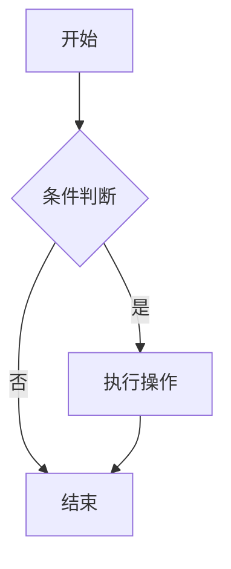
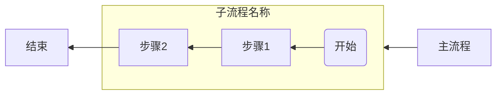
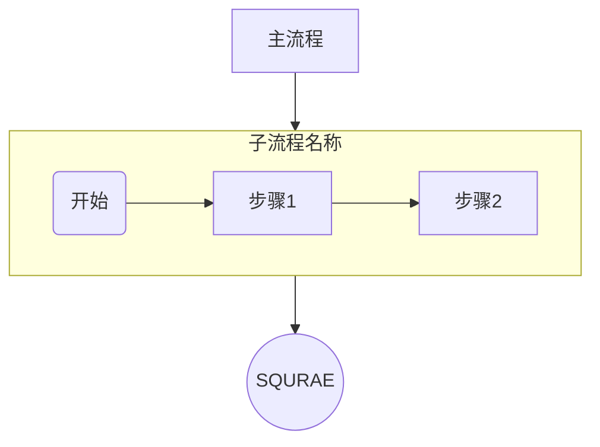
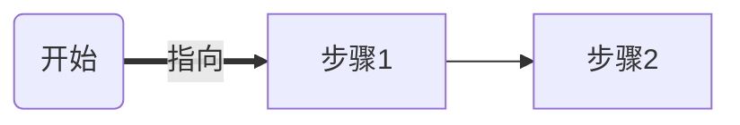
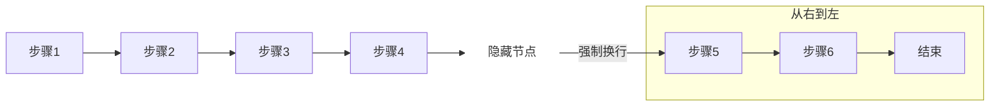
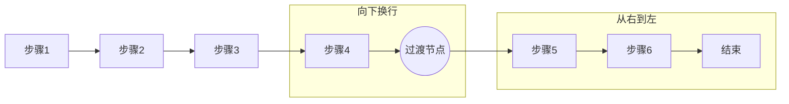

## <font color = blue face=楷体 size=6>日期 4.07 </font>

## <font color = green>知识学习 </font>
### <font color = purple>专业知识 </font>
+ <a id = "01-1">  [<font color = red>跳转</font>](#01-2)
   > <font color = o> 说明 </font>
### <font color = purple>生活常识 </font>

### <font color = purple>求职 </font>


## <font color = green>心得 </font>
### <font color = purple>学习心得 </font>
+ 
### <font color = purple>生活技巧 </font>

### <font color = purple>Good Idea </font>


## <font color = green>新名词 </font>
### <font color = purple>英文单词 </font>
### <font color = purple>新词 </font>
+ mermaid


## <font color = green>各类网站 </font>


## <font color = green>资源文件 </font>


## <font color = green>新闻 </font>


## <font color = green>新知 </font>
+ 

## <font color = green>待办事项 </font>
### <font color = purple>事项 </font>
- [ ] ...【挑战1分钟学会用Deepseek+Mermaid一键生成流程图-哔哩哔哩】 https://b23.tv/BC6Xqcs
- [ ] 【漂亮的手绘效果的流程图，开源、免费，DeepSeek生成的mermaid流程图也能一键导入-哔哩哔哩】 https://b23.tv/6fpV7tx
- [ ] https://it.sohu.com/a/804334880_114819
- [ ] 【手把手教你使用DeepSeek进行文献阅读】 https://www.bilibili.com/video/BV17zNUeuE2u/?share_source=copy_web
- [ ] https://zhuanlan.zhihu.com/p/23449431801
- [ ] https://zhuanlan.zhihu.com/p/24925934142
### <font color = purple>已解决 </font>
### <font color = purple>疑问 </font>
- [ ] **如何批量下载twitter用户主页的所有视频以及对应链接**
### <font color = purple>明日计划 </font>
- [ ] ...

 

## <font color = green>备注 </font>
  1. <a id ="01-2">[<font color = red>跳回</font>](#01-1)
https://mp.weixin.qq.com/s/68ODK1nPWixCK_DZSkqgKw

https://www.lianxh.cn/news/94f69493f819c.html









```mermaid

```
<!--stackedit_data:
eyJoaXN0b3J5IjpbLTMzMjE4OTczOCwxNzAzOTg3NTU5LC00OT
I4MzQ2MTYsLTE2OTQ5Nzk0NzAsMTMwODMyNDc0MSwxMDQ1MDUz
MTc3LC0xODQ0MTE5MTQyLC0zMTQwNDQzMTIsLTEyNjA2MjU3Mz
IsMTg4MDUzNjAzOCw0OTk5MDEyODgsMTA1OTE5OTc1MywxMjE4
NzQzNDAzLC0yMDM3MzM1MDExLDEwNTQyODM0NjUsLTI4NzY5Nz
U0Myw3MzQxNDQ1MSwxOTYwNzU5MjQ1XX0=
-->