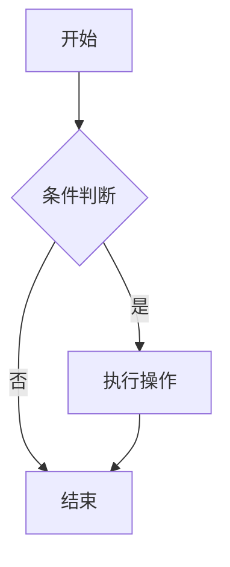
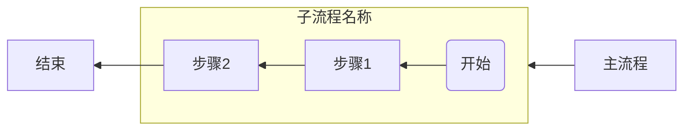
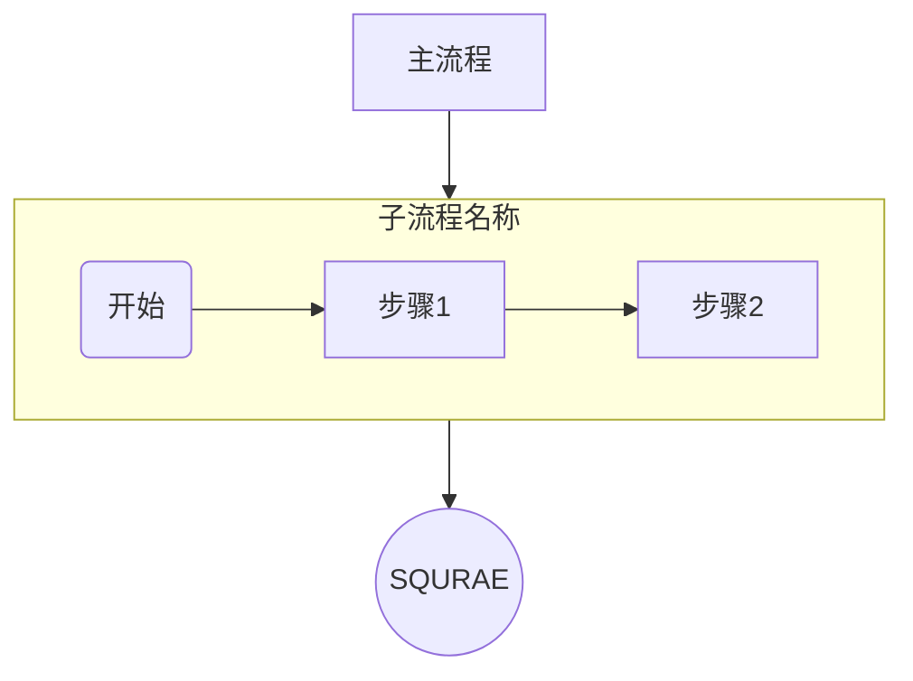

## <font color = blue face=楷体 size=6>日期 4.07 </font>

## <font color = green>知识学习 </font>
### <font color = purple>专业知识 </font>
+ <a id = "01-1">  [<font color = red>跳转</font>](#01-2)
   > <font color = o> 说明 </font>
### <font color = purple>生活常识 </font>

### <font color = purple>求职 </font>


## <font color = green>心得 </font>
### <font color = purple>学习心得 </font>
+ 
### <font color = purple>生活技巧 </font>

### <font color = purple>Good Idea </font>


## <font color = green>新名词 </font>
### <font color = purple>英文单词 </font>
### <font color = purple>新词 </font>
+ mermaid


## <font color = green>各类网站 </font>


## <font color = green>资源文件 </font>


## <font color = green>新闻 </font>


## <font color = green>新知 </font>
+ 

## <font color = green>待办事项 </font>
### <font color = purple>事项 </font>
- [ ] ...
### <font color = purple>已解决 </font>
### <font color = purple>疑问 </font>
- [ ] **如何批量下载twitter用户主页的所有视频以及对应链接**
### <font color = purple>明日计划 </font>
- [ ] ...


## <font color = green>备注 </font>
  1. <a id ="01-2">[<font color = red>跳回</font>](#01-1)
https://mp.weixin.qq.com/s/68ODK1nPWixCK_DZSkqgKw

https://www.lianxh.cn/news/94f69493f819c.html






```mermaid
 graph LR 子流程[名词] 
		
        B1(开始) --> C1[步骤1]
        C1 --> D1[步骤2]
```
<!--stackedit_data:
eyJoaXN0b3J5IjpbMTg4MDUzNjAzOCw0OTk5MDEyODgsMTA1OT
E5OTc1MywxMjE4NzQzNDAzLC0yMDM3MzM1MDExLDEwNTQyODM0
NjUsLTI4NzY5NzU0Myw3MzQxNDQ1MSwxOTYwNzU5MjQ1XX0=
-->