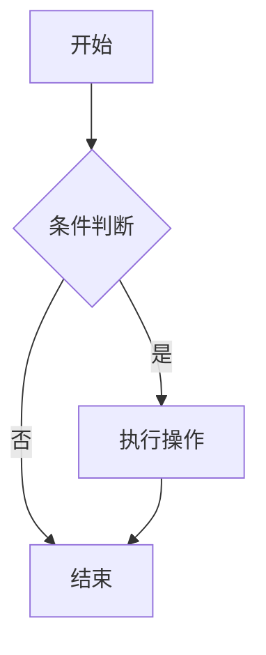
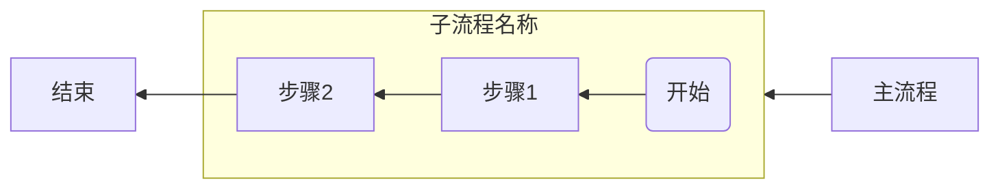
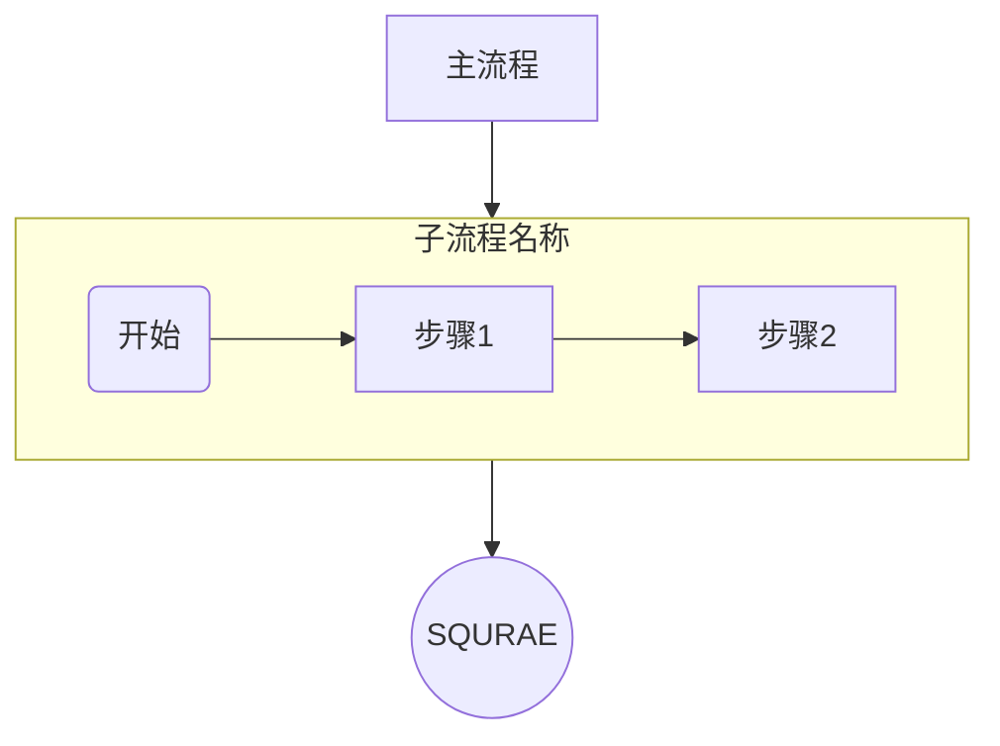
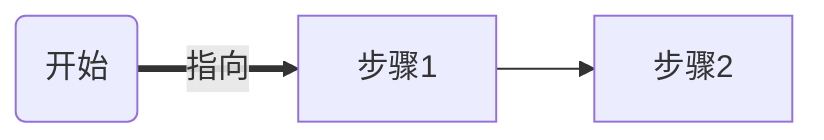
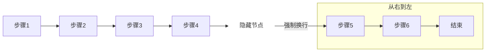
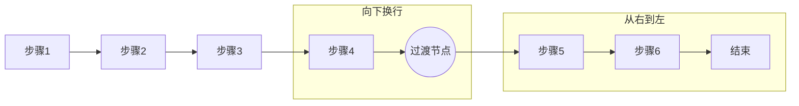

## <font color = blue face=楷体 size=6>日期 4.07 </font>

## <font color = green>知识学习 </font>
### <font color = purple>专业知识 </font>
#### 各款流程图工具对比  
根据DeepSeek分析推荐，综合易用性、功能全面性、兼容性、是否免费、社区生态、入门难度，综合选出了以下几款绘制流程图的工具。<a id="01-1"> [<font color = red>**跳转**</font>](#01-2)

Visio、PPT、Figma、ProcessOn、Draw.io、Mermaid。

除此之外，latex也可以用Tikz宏包来画流程图，不过latex使用起来太麻烦了，暂且不用。关于用latex实现流程图的例子，可以参考文章


####	DeepSeek 使用

+ **deepseek在年初还能用它访问其他网址的链接，现在不行了**  
	https://zhuanlan.zhihu.com/p/24925934142
- [ ] 【手把手教你使用DeepSeek进行文献阅读】 https://www.bilibili.com/video/BV17zNUeuE2u/?share_source=copy_web

- [ ] **DeepSeek实战：3分钟学会提取网页纯文本！(含提示词)**  
	https://zhuanlan.zhihu.com/p/23449431801
- [ ] https://it.sohu.com/a/804334880_114819


+ <a id = "01-1">  [<font color = red>跳转</font>](#01-2)
   > <font color = o> 说明 </font>
### <font color = purple>生活常识 </font>

### <font color = purple>求职 </font>


## <font color = green>心得 </font>
### <font color = purple>学习心得 </font>
#### Latex中插入Mrakdown代码的一个小细节
在Latex代码中，%会被作为注释的符号，因此如果想要在Latex里面插入嵌有图片链接的Markdown代码，该图片url中含有%的话，通常会无法展示且报错。如果用转义字符把%转换为\%，同样不可行。

#### Mrakdown代码编写的一个小技巧
在Markdown的各级列表中，如果想实现把标题放在列表里，一定要注意标题与列表的对齐。一级标题往后一格，二级标题往后两个，以此类推...编辑时，可以看实时的渲染效果来改变对齐的位置。
### <font color = purple>生活技巧 </font>

### <font color = purple>Good Idea </font>


## <font color = green>新名词 </font>
### <font color = purple>英文单词 </font>
### <font color = purple>新词 </font>
+ **Mermaid**
	Mermaid‌ 是一个基于JavaScript的图表工具，它使用Markdown风格的语法来绘制各种图表。Mermaid允许用户通过编写特定的文本代码来生成流程图、时序图、甘特图等多种类型的图表，极大地简化了图表创建的过程‌。具有以下特性：
	1. 跨平台兼容性‌：Mermaid可以无缝嵌入GitHub、Notion、VS Code等开发协作工具，支持在Markdown和HTML中直接使用‌。‌
	2. AI增强‌：结合DeepSeek等工具，可以通过自然语言生成图表代码，降低了使用门槛‌。‌
	3. 自定义样式‌：支持通过CSS调整节点颜色、字体等，使得图表更加个性化‌。
	4. 易于使用‌：Mermaid的语法简单直观，即使没有编程基础的用户也能快速上手‌。
https://zhuanlan.zhihu.com/p/683582533
## <font color = green>各类网站 </font>


## <font color = green>资源文件 </font>


## <font color = green>新闻 </font>


## <font color = green>新知 </font>
+ 

## <font color = green>待办事项 </font>
### <font color = purple>事项 </font>
- [ ] ...【挑战1分钟学会用Deepseek+Mermaid一键生成流程图-哔哩哔哩】 https://b23.tv/BC6Xqcs
- [ ] 【漂亮的手绘效果的流程图，开源、免费，DeepSeek生成的mermaid流程图也能一键导入-哔哩哔哩】 https://b23.tv/6fpV7tx


### <font color = purple>已解决 </font>
### <font color = purple>疑问 </font>
- [ ] **如何批量下载twitter用户主页的所有视频以及对应链接**
### <font color = purple>明日计划 </font>
- [ ] ...

 

## <font color = green>备注 </font>
  1. ### **1. 核心功能特点**
		#### 📌 **易用性**

		-   **拖拽式操作**：快速添加节点、连线，无需复杂学习。
    
		-   **模板库**：内置常用流程图模板（如业务逻辑、系统设计等）。
    
		-   **自动对齐/吸附**：节点自动对齐网格，排版整洁。
    

		#### 📌 **图形表达能力**

		-   **多样化的节点形状**：基础形状（矩形、菱形、圆形）和行业专用图标（如UML、数据库、网络设备）。
    
		-   **灵活的连线样式**：支持箭头、虚线、标签、跳线（跨线避让）。
    
		-   **注释与标注**：可添加文字注释、颜色标记、分组框。
    

		#### 📌 **兼容性与扩展性**

		-   **多格式导出**：支持导出为图片（PNG/SVG）、PDF、Markdown（如 Mermaid 代码）、Visio 文件等。
    
		-   **跨平台协作**：支持云端同步、多人实时编辑（如 FigJam、Lucidchart）。
    
		-   **插件/API 支持**：能与常用工具集成（如 VS Code、Notion、Confluence）。
    


		### **2. 加分项**

		#### 🚀 **智能化功能**

		-   **自动布局**：一键整理复杂流程图结构（如 Graphviz 引擎）。
    
		-   **版本控制**：保存历史记录，支持回滚到任意版本。
    
		-   **交互式预览**：可点击节点跳转或展开详细信息。
    

		#### 💡 **轻量化与性能**

		-   **离线使用**：无需网络即可编辑（如桌面端工具）。
    
		-   **低配置需求**：在老旧设备或浏览器中流畅运行。
    

		#### 🌐 **社区与生态**

		-   **活跃社区**：丰富的用户案例和问题解答（如 Mermaid 的 GitHub 社区）。
    
		-   **插件生态**：支持第三方插件扩展功能（如 Draw.io 的插件库）。<a id ="01-2">[<font color = red>跳回</font>](#01-1)

2. 
https://mp.weixin.qq.com/s/68ODK1nPWixCK_DZSkqgKw

https://www.lianxh.cn/news/94f69493f819c.html









```mermaid

```

### 流程图工具对比分析

#### 核心功能对比表

| 工具          | 易用性       | 图形表达能力     | 兼容性/扩展性          | 智能化功能      | 轻量化与性能     | 社区与生态       | 成本              |
|:---------------:|--------------|------------------|------------------------|-----------------|------------------|------------------|-------------------|
| **Visio**     | 中等（需学习）| 极强（专业模板） | 支持多种格式导出（需订阅）| 自动布局一般    | 重（依赖桌面端） | 企业级支持        | 高（订阅制）      |
| **PPT**       | 简单         | 有限（基础形状） | 依赖 Office 生态       | 无自动布局      | 中等             | 无专业社区       | 需 Office 授权    |
| **Figma** | 中等（设计向）| 强（自由设计）   | 导出 PNG/SVG，协作云端 | 插件扩展        | 云端依赖网络     | 活跃设计社区     | 免费+付费高级功能 |
| **ProcessOn** | 简单         | 中等（模板丰富） | 导出图片/PDF，协作云端 | 基础自动布局    | 云端依赖网络     | 中文社区支持     | 免费+会员制       |
| **Draw.io**   | 简单         | 中等（足够通用） | 多格式导出，开源集成   | 基础自动布局    | 轻量（Web/桌面） | 开源社区活跃     | 完全免费          |
| **Mermaid**   | 较高（需代码）| 基础（依赖语法） | 无缝集成 Markdown      | 无GUI，纯文本   | 极轻（文本驱动） | 开发者社区       | 完全免费          |

---

#### 2. 分工具详细分析

##### Microsoft Visio
- **优势**：
  - 专业性强，支持复杂流程图、UML、架构图。
  - 企业级兼容，与 Office 套件深度集成。可以导入doc文件。
- **劣势**：
  - 成本高，学习曲线陡峭。
- **适用场景**：企业级专业图表设计。

##### PowerPoint (PPT)
- **优势**：
  - 普及率高，适合快速插入简单流程图。
- **劣势**：
  - 功能局限，非专业工具。
- **适用场景**：会议展示中的简单流程图。

##### Figma
- **优势**：
  - 设计自由度高，实时协作强。
- **劣势**：
  - 流程图功能非核心，依赖网络。
- **适用场景**：结合 UI 设计的创意流程图。

##### ProcessOn
- **优势**：
  - 中文友好，协作便捷。
- **劣势**：
  - 功能深度不足，导出限制多。
- **适用场景**：中小团队快速协作。

##### Draw.io (Diagrams.net)
- **优势**：
  - 完全免费，跨平台灵活。可以输入latex命令。
- **劣势**：
  - 模板较少，自动布局弱。图标不支持中文搜索。
- **适用场景**：日常使用与开源项目。

##### Mermaid
- **优势**：
  - 文本驱动，无缝集成 Markdown。
- **劣势**：
  - 学习门槛高，样式局限。
- **适用场景**：技术文档与开发者笔记。

---

#### 3. 综合总结

##### 推荐场景
- **企业级专业设计** → Visio / Lucidchart  
- **开发者与技术文档** → Mermaid + Draw.io  
- **中文团队协作** → ProcessOn / 飞书文档  
- **创意设计结合UI** → Figma / Whimsical  
- **临时简单需求** → PPT / Draw.io  

##### 避坑指南
1. **避免 Visio**：除非企业已采购或需超复杂图表。
2. **慎用 PPT**：仅限极简流程图，长期效率低。
3. **慎选 ProcessOn**：免费版功能限制多，需评估会员需求。

<!--stackedit_data:
eyJoaXN0b3J5IjpbMTIxNzA5NDMzNCwxOTE5Njk3Njc0LDI2Mz
U2ODM0OCwtMTY5NTQ4NzM3MCw4NTc2NTU1NDIsNDk5MTkyNDkz
LC0xODQ5Mzk0NTM3LC0xMzYxNDM4OTI2LDE1NDUwNzcwNzIsLT
MzMjE4OTczOCwxNzAzOTg3NTU5LC00OTI4MzQ2MTYsLTE2OTQ5
Nzk0NzAsMTMwODMyNDc0MSwxMDQ1MDUzMTc3LC0xODQ0MTE5MT
QyLC0zMTQwNDQzMTIsLTEyNjA2MjU3MzIsMTg4MDUzNjAzOCw0
OTk5MDEyODhdfQ==
-->