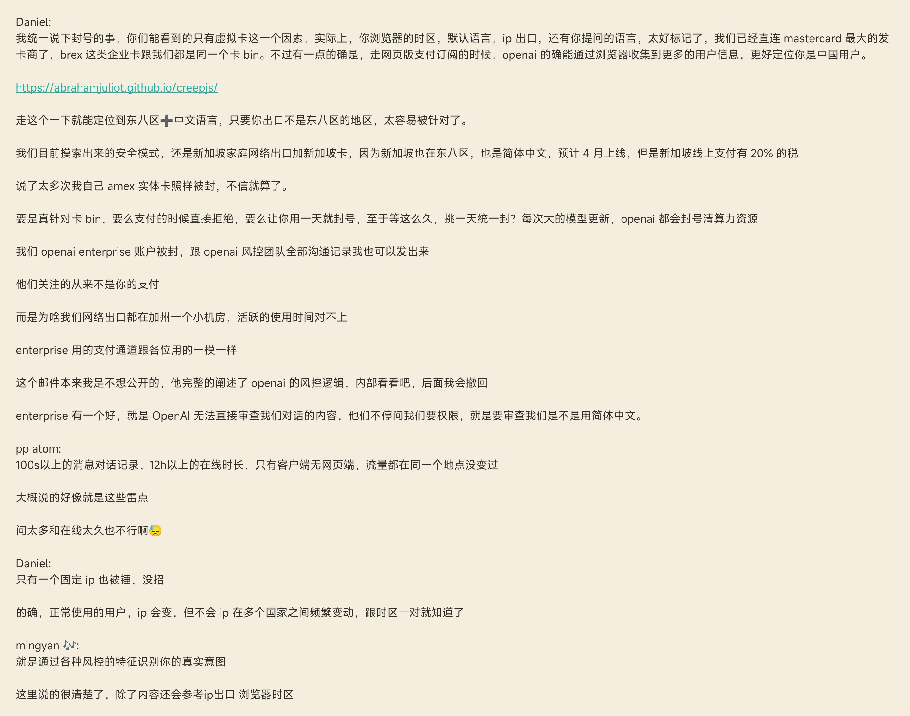

## <font color = blue face=楷体 size=6>日期 4.08 </font>

## <font color = green>知识学习 </font>
### <font color = purple>专业知识 </font>
+ 
   > <font color = o> 说明 </font>
### <font color = purple>生活常识 </font>
#### Markdown语法嵌入图片的一个小技巧  
有时候，复制了网页中图片的链接后，直接用``会无法展示图片。此时可以观察一下url的格式，尝试去掉一些多余的字符，看是否能够打开，例如：
```

```
### <font color = purple>求职 </font>


## <font color = green>心得 </font>
### <font color = purple>学习心得 </font>
#### StackEdit 的一个使用技巧
对于StackEdit中很长的url，如果在平板上直接复制它往往会出现错误。
例如：在编辑器里面复制，可能只复制到一部分；在预览框复制，url链接可能被转义，所以复制的链接也不正确。（在电脑上就不会有这个问题）

一种解决方法是：把链接放入代码框中，然后平板端在预览框就可以显示全部url。之后再【扩选】---【复制】即可（有时没有复制到剪切板，可再操作一次）。

参考此例：
https://viewer.diagrams.net/?tags=%7B%7D&lightbox=1&highlight=0000ff&edit=_blank&layers=1&nav=1&title=ceshi1.png&dark=auto#Uhttps%3A%2F%2Fraw.githubusercontent.com%2Fzeff163%2FDraw.io%2Fmain%2Fdraft%2Fceshi1.png

```
https://viewer.diagrams.net/?tags=%7B%7D&lightbox=1&highlight=0000ff&edit=_blank&layers=1&nav=1&title=ceshi1.png&dark=auto#Uhttps%3A%2F%2Fraw.githubusercontent.com%2Fzeff163%2FDraw.io%2Fmain%2Fdraft%2Fceshi1.png
```

### <font color = purple>生活技巧 </font>

### <font color = purple>Good Idea </font>


## <font color = green>新名词 </font>
### <font color = purple>英文单词 </font>
### <font color = purple>新词 </font>


## <font color = green>各类网站 </font>


## <font color = green>资源文件 </font>


## <font color = green>新闻 </font>


## <font color = green>新知 </font>
### <font color = purple>使用野卡服务的一些总结</font>
####  关于ChatGPT账号被封的一些原因  
  

+ 上面提到的网站：https://abrahamjuliot.github.io/creepjs/
+ 网站来源：https://github.com/KajalGaikwad22/puppeteer-web-scraping
+ 网站的作用：Puppeteer作为基于Node.js的浏览器自动化工具，可通过高级API实现复杂网页数据的精准抓取，包括信任评分、机器人状态检测和浏览器指纹（FP ID）等特定信息的提取。

#### 用虚拟卡订阅Onlyfans时 地址错误/无法支付/年龄验证等解决方案  <a id = "01-1">  [<font color = red>备注1</font>](#01-2)
https://help.bewildcard.com/zh-CN/articles/8912043-onlyfans-%E5%9C%B0%E5%9D%80%E9%94%99%E8%AF%AF-%E6%97%A0%E6%B3%95%E6%94%AF%E4%BB%98-%E5%B9%B4%E9%BE%84%E9%AA%8C%E8%AF%81%E7%AD%89%E8%A7%A3%E5%86%B3%E6%96%B9%E6%A1%88  

#### 临时邮箱的注册


## <font color = green>待办事项 </font>
### <font color = purple>事项 </font>
- [ ] ...
### <font color = purple>已解决 </font>
### <font color = purple>疑问 </font>
- [ ] ...
### <font color = purple>明日计划 </font>
- [ ] ...


## <font color = green>备注 </font>
  1. <a id ="01-2">[<font color = red>跳回</font>](#01-1) 
	  很多客户在 Onlyfans 绑卡时，出现了地址错误，年龄验证，无法支付等各种问题。出现这个问题的原因，<font color = red>**一是用国内邮箱注册了，二是 ip 有问题**</font>，会导致出现年龄验证，或无法支付 Onlyfans 等问题。  
		+	**年龄验证问题：**
		请您在填写账单地址的时候，不要选择德克萨斯、蒙大拿、北卡罗来纳州、弗吉尼亚州、路易斯安那州、阿肯色州、密西西比州和犹他州，这些州全部通过了年龄验证法，也就是强制这些州验证访客的年龄。
		+	**地址错误问题：**
		注意，绑卡填地址的时候，<font color = red>**一定要从 onlyfans 地址补全的下拉框里面选**</font>，随意选择即可，有小概率我们提供的账单地址没法匹配到，这个时候，<font color = red>**随意从下拉框里面选择一个接近地址**</font>的即可。
		


<!--stackedit_data:
eyJoaXN0b3J5IjpbLTE3MTk5NjczNDAsMTA3OTQ3NTkyNiwtMT
M3NzkzNDExNSwxMjgxOTExNDA3LDU2OTQyMTI1NCwxNjA0Njcy
OTI5LDEzNjc5NTQ5NDYsLTI1NjA5NjQxNiwtMTM0Nzc2NjQzNi
wzNzE5Mzg4NDYsMTM2Nzk1NDk0NiwtMzI1OTYwMTA1LDEyMjUz
ODA5NDFdfQ==
-->