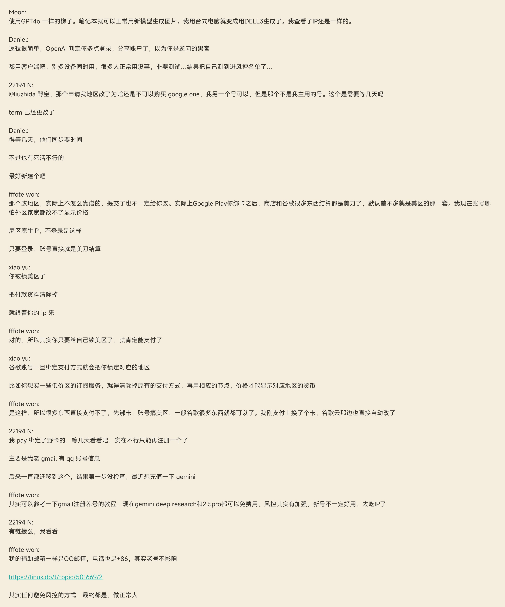

## 日期 4.10 

## 知识学习 
### 专业知识 
+ <a id = "01-1">  [跳转](#01-2)
   >  说明 
### 生活常识 

### 求职 

## 心得 
### 学习心得 
+ 
### 生活技巧 
#### PDF24怎么给pdf文件加空白页
删除某页pdf在主页可以很容易找到，增加空白pdf则需要在【组织pdf】中，拖拽要处理的pdf，点击要增加空白页位置的页码，然后选中该页，右键【向前新增空白页】/【向前新增空白页】即可。
### Good Idea 

## 新名词 
### 英文单词 
### 新词 

## 各类网站 

## 资源文件 

## 新闻 

## 新知 
#### Google Play不同地区支付的一个讨论

## 待办事项 
### 事项 
- [ ] ...
### 已解决 
### 疑问 
- [ ] ...
### 明日计划 
- [ ] ...

## 备注 
  1. <a id ="01-2">[跳回](#01-1)

<!--stackedit_data:
eyJoaXN0b3J5IjpbNTAyNDE5OTY0LC03NDM5NjcyOCwtMTM3Mj
A3NDYzNV19
-->