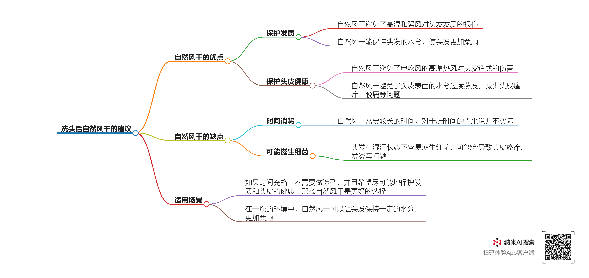

## 4.0 
- [ ] 【临时邮箱注册】内容的编写
- [ ] 野卡邮箱注册、电话注册、咨询客服
- [ ] 网站 https://github.com/anyofai/anyofai.github.io  Readme.md写法的学习
- [ ] Stackedit 不同平台发生冲突的原因
- [ ] 该如何有效对文章内容进行提炼，生成思维导图
	参考样式：
	
- [ ] 	Stackedit配置：包括导入CSS文件、修改顶部快捷键栏等
 
## 4.098 
- [ ] Twitter个人主页视频**批量**下载 
- [ ] PDF中复制文本时，会根据文章句子的换行而出现换行，应该如何根据语境重新解决。例如下面一段复制的话：
	
	真正的奖励不会留给
那些熟练使用脸谱网的人（这是一项浮浅任务，很容易复制），而是留
给那些能够构建创新的分散式体系，使这项服务能够运转的人（毫无疑
问是一种深度任务，很难复制）。
- [ ] 常用绩效考核工具和方法大盘点
	https://mbd.baidu.com/newspage/data/dtlandingsuper?nid=dt_4483281654258152058&sourceFrom=search_a
- [ ] Markdown 教程-使用自定义CSS样式
	https://zhuanlan.zhihu.com/p/672254528
- [ ] MarkDown中实现目录页面内跳转(Markdown锚点的使用总结)
	https://www.jianshu.com/p/4898c2e9a36d
- [ ] 上面那篇文章博主的主页，需要总结其中的一些技术文章
	https://www.jianshu.com/u/7ecaba2d594c
- [ ] 一个介绍Markdown使用的Github Readme.md 	
	https://github.com/Eished/Markdown_notes/?tab=readme-ov-file 
- [ ] 	上面那篇文章博主的github主页，需要总结
	https://github.com/Eished 
-  [ ] LaTeX 表格可同时具备 tabularx 和 longtable 功能吗?
	https://mp.weixin.qq.com/s/y3c0f50q2vt6Nkp2CYPOfA
	
- [ ] 手把手教你下载 IEEE 期刊 LaTeX 模版，所有 IEEE 期刊通用
	https://mp.weixin.qq.com/s/4cnBZFDfodUcirV43ktG9w
- [ ] Markdown 中的数学公式（怎么用Markdown实现这篇文章中的脚标和引用框效果）
	https://mp.weixin.qq.com/s/wy-xeVKKpp7rfd_E-m0pXw
	
- [ ] 全民都可以用的北大AI来了！https://mp.weixin.qq.com/s/cb7HcbgP0D6TJ4AYSvyVDA
	
- [ ] PDF 翻译神器，读文献靠谱！
	https://mp.weixin.qq.com/s/Eyzyp8126gCKOXEdeP9fzw

- [ ] 怎么在stackedit中正确显示微信的链接图 
p-HD5r53N6--vmvsrPB_6g
<!--stackedit_data:
eyJoaXN0b3J5IjpbLTE1OTgzOTgwNTMsLTIxNDAzMTUzMTksNj
c0NDg3MjgyLC0xNDYzNTAzMDYwLC0xMzM3MDIyODc0LC0xMzM3
Mjg3MjE3LC0xNjI3OTgwMDE1LDc3NDQ2OTk4LC02NDc2OTcxMz
ksLTE0ODgyMDQ1MDMsLTM3ODkwOTQ5OCwtNjQxODA3ODIyLDE4
Njk5MjE2ODksNjc3MDE5MTI1LC0xNTcyMDQ1OTM1XX0=
-->