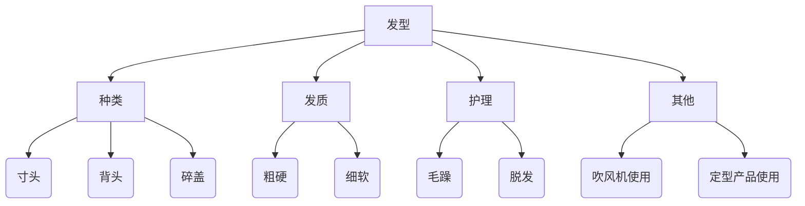

## 该不该学、了解、思考？
这个问题实际上就是在谈论：**该不该在这些知识上花时间？**

一般每天接触的知识按照**重要程度**可以分为以下几种：

1. **目前需要，扩充知识量**  （增长技能）
例：《Latex简明教程》的学习

2. **觉得将来可能需要**  （积累素材）
例：常用绩效考核工具和方法大盘点

3. **未必需要，扩充知识面**   （增长见识）
例：全民都可以用的北大AI来了

4. **个人兴趣**   （情绪价值）
例：一些数学难题，例如：自己思考“3x+1”问题

5. **学习时或工作时遇到的问题**   
例：Stackedit 不同平台发生冲突的原因

根据知识需要学习的时间长短，可以分为以下几种：
+ 大型知识（a）：学习法律（半月到数月之久）
+ 中型知识（b）：学习发型打理（一日到几日）
+ 小型知识（c）：怎么翻译英文文献（几十分钟到一小时）
+ 微型知识（d）：高铁上为什么没有E座 （几分钟）

注：关于学习时长，这个其实因人而异，有的人可能需要几小时，有的人则需要学几天。  

对于知识种类，优先程度是：1 > 5 > 2 > 3 > 4 。
对于学习时长，优先程度是：d > c > b > a。
> 注1：1、5、2的排名应该不难理解，为什么3的优先度高于4？
> 因为：3学习了可以获得实实在在的知识，而4思考了不一定会有收获，可能白白浪费时间。
> 
> 注2：有时候会对学习时长有错误的估计。
> 例如：思考“3x+1”问题是属于a类的，但可能有人以为是c类，然后花了半天的功夫，也没做出什么结果。
> 当然不排除这个问题对某些人来说就是c类的，就像前面提到的，每个人的学习时长因人而异。

于是综合这两方面，个人给了如下排名：
$$
\begin{align*}
{\color{red}d1}&>{\color{blue}d5}>{\color{red}c1}>{\color{blue}c5}>{\color{orange}d2}\\
&>{\color{red}b1}>{\color{orange}c2}>{\color{blue}b5}>{\color{green}d3}>{\color{purple}d4}\\
&>{\color{red}a1}>{\color{blue}a5}>{\color{green}c3}>{\color{orange}b2}>{\color{purple}c4}\\
&>{\color{green}b3}>{\color{purple}b4}>{\color{orange}a2}>{\color{green}a3}>{\color{purple}a4}
\end{align*}
$$

**有时候任务的重要程度会发生变化，例如：当完成了某个1号任务后，可能一个2号任务就变成了当前的1号任务，那么时间分配的先后顺序也将发生改变。**

**问题1：同一级任务，应该怎么区分先后？**
例如：同为d2级任务，哪个先哪个后？
建议：根据估计的任务时长，以及和当前主要任务的关联度进行选择。

## 要去学什么？
当确定学一个知识后，需要想清楚要去学关于这个知识的哪些方面？
通常可以按照五个步骤进行划分：
+ 是什么：这个问题主题谈论的对象是什么？
+ 为什么：为什么会发生这种现象或问题？
+ 有什么用：了解这个问题有什么价值？
+ 怎么做：如何解决这个问题，或者如何使用这个工具？
+ 有何联系：该问题可能涉及到哪些知识点？

> **注1：【为什么】和【会不会、是不是】有时候可以相互转化。**
> + 为什么春分点会西移？
>   这个问题可以转换成：春分点是不是固定的？
> +  羊肉是不是不能和竹笋一起吃？
>   这个问题可以转换成：为什么羊肉和竹笋不能一起吃？
> 
> 【为什么】可以看成是【会不会、是不是】的一个深入探究。【会不会、是不是】关心的是现象是否存在，而【为什么】关心的是现象的原因。
> 不过很多时候人们只关心【会不会、是不是】的现象，不在乎背后复杂的机理。

**为什么要思考这几个步骤？**
+ 是什么：认清讨论的对象，便于之后知识点的分类整理（贴标签）。
+ 为什么：分析背后的原因，为【怎么做】提供解决的方向。
+ 有什么用：判断该知识的**重要程度**，确定该问题时间分配的先后顺序。
+ 怎么做：问题解决的核心，一般需要根据原因来实践
+ 有什么联系：思考和不同知识的**关联度**，触发思维创新，构建知识网，生成启发式联想，便于后期搜索推荐。

> 注：一般学习知识的核心是【为什么】和【怎么做】，其中有些是需要明确要求知道怎么做的，例如：《怎么使用 Draw.io 绘制流程图》，还有些是要求分析原因的，例如：《为什么Github在国内网络无法访问》

下面通过几个例子来说明：
#### Stackedit 不同平台发生冲突的原因？
+ 是什么：Stackedit的云同步功能
+ 为什么：为什么会发生冲突
+ 有什么用：防止同步时数据混乱，重新核对修改增加工作时间（第5类）
+ 怎么做：不理会、不使用Stackedit、根据为什么来依次解决
+ 有什么联系：和其他同步方式的异同，例如：Git的同步方式。在线Markdown编辑器的优缺点。

#### 使用公司WiFi，真的会被领导看到聊天记录吗？
+ 是什么：公司WiFi的安全性
+ 为什么：为什么用公司WiFi会被看到
+ 有什么用：防止隐私被人窥探（第2类）
+ 怎么做：不理会、不使用WiFi、根据原因解决
+ 有什么联系：其他公司检测隐私行为的方式。

#### 面霜选哪个牌子？
+ 是什么：面霜护肤
+ 为什么：不同面霜成分不一样，功效不一样
+ 有什么用：脸部保湿，延缓衰老（第2类）
+ 怎么做：不用面霜、随便挑选、根据为什么来分析
+ 有什么联系：面膜选什么牌子？不同地区的面霜会有什么影响？

**问题1：有时候产生一个问题的原因有很多个，或者解决方法有很多个，即【为什么】和【怎么做】有很多内容，该如何学习？**
例如：怎么修改Markdown脚注格式？
解决这个问题的方法，有很多个。比如：使用CSS来定制，或者在一些特殊的Markdown编辑器里直接用模板即可。

建议：采用**二八定律**，因为不可能弄清所有的做法，所以学习最普遍的做法。可以把那些其他的复杂方法记录下来，但不去深入了解，将来用得上的时候再来检索学习。

## 笔记记什么？
根据刚才的分析，可以把知识点划分成**已经学过的知识**和**暂时未学的知识**，对这两类实际上记录的内容不一样。

### 待学习知识
+ **划分标准：** 根据知识的**日期**、**重要程度**、**时长**进行划分
+ **需要记录的内容：** 来源、标题、【是什么】（关键词）

补充1： 在1级和2级重要程度之间建议加上一个**过渡态**，因为有时候当一些1级任务完成，部分2级任务就会变成了1级，因此需要把这些任务单独拎出来标记

补充2：最好的方式是把每个任务按照分类贴上多个标签。
例如：某个4.22日生成的d3级任务就是【4.22】、【d类】、【3级任务】，那么当搜索所有3级任务时，该任务便会出现，如果只是把它们和其他各类任务放在一页的文件里，便不方便检索和观察。

补充3：1级任务放在明日计划里标注，和这个任务有关的任务均视为1级任务，需要标红。

**问题1：有时候学一个新东西的时候，会冒出很多其他的新知识。那么该如何处理这些知识？**  
1. 随时记录，根据该知识的**重要程度**和**花费时长**来决定该目标的完成顺序
例如：在学习Markdown语法时，遇到了以下几个新知识
	+ html标签：该知识属于b5。
	+ 标准Markdown语法和不同平台支持的扩展语法：该知识属于c3
	+ Markdown创始人之间发生的纠纷：该知识属于d4

	所以先后顺序是：b5 > d4 >c3 。
2. 粗略了解，不去深究后面几步，只是学习第一步【是什么】，减少**花费时长** 
例如：同样是上面的问题，对于第二个知识点，可以不去深入了解扩展语法和标准语法的区别，而是仅知道这两个语法之间存在差异，以及哪些常见平台不支持扩展语法（例如Github不支持KaTex），那么所需要的时间就从c类变为d类，因此，任务类型变成了d3。
顺序就变成了：b5 > d3 > d4 。
	> 注：这样操作只是为了符合【人们只关心会不会、是不是的现象，不在乎背后复杂的机理】，但如果这个知识比较重要，之后还是需要花时间去学习   

**问题2：未学习的知识需要写在每日任务里吗？**
需要。实际上可以只进行该知识学习的第一步，即【是什么】的过程，那么几分钟就可以完成了解，然后分清该知识对应的关键词主题是什么，之后在每日计划里面记录关键词，便于以后的检索和再学习。

### 已学习知识

记什么东西

知识点的划分，哪个部分的知识

知识点来源的相关度和文章内容的水平

其中一个做法是采用CSS定制，也许一篇文章专门讲CSS定制，只是稍微提了一些怎么修改脚注，那么这篇文章应该纳入什么体系中？

如何利用工具简化记录的过程，缩短记录的时间

学的东西不科学，不系统

### 其他
+ 一些灵感
+ 一些学习心得

一个可以参考的笔记卡片：[来源](https://www.zhihu.com/pin/1728730354213556225)

块级鲁棒性‌	Roam Research	基于唯一块ID实现稳定嵌套，重命名或移动内容不影响已有链接关系

这种以引文为主的管理方法都不能成为图书馆的主力方法，它更多是在发挥辅助的作用——通过文献计量学的方法发现一些**更内部的主题**。

信息组织和信息检索领域有一条著名的规律：组织成本和检索成本成反比。

用几个关键词来进行全文检索呗。到这种全文检索返回的笔记数量是很多的。我们还得一条一条的阅读，然后才能找到

一个工具用于收集信息，一个用于整理

#### 知识划分的最小单元和人体细胞的类比
关于知识划分的粒度：其实学一个知识和完成一个任务很多时候都是一样的。通常一句话就可以构成一个知识、消息（例如：MCP协议是由Antrophic公司于2024年提出的；或者新闻：特朗普对东南亚四国光伏产业征收高达3521%的关税），因此可以把它们类比成细胞。那么一群细胞构成组织，不同组织构成器官，各类器官组成系统，系统又构成了个体。所以很多知识、任务最终都是一堆【知识单元】——句子的集合，而这些【知识句子】也是互相联系的，这就好比人的肝脏和心脏都有肌肉组织，都含有平滑肌细胞。
所以分解知识或任务可以细分到一句话、一个动作，只要他有研究的必要。当然你也可以从一篇文章来分析，这就好比从【组织】来解剖人体；从一本书分析，从【器官】来解剖人体；从一个体系的书来分析，从【系统】来解剖人体；那么当你掌握了所有体系的知识之后，也就构成了一个完整的人。

#### 如何知识分类的一个常见困扰
+ 困扰
在知识分类时，通常会遇到一个困扰，比如读了一篇新的文章，该贴什么标签？该用什么关键词进行总结？有时候刚刚获得新知的一腔喜悦会被这个简单的分类给扰了心情。

+ 分析
如果分析这种思考标签类型行为，会发现这是一种思考的浪费。大脑在刚刚结束了复杂的脑力活动后，本可稍加休憩，结果却还需要在最后关头重新激活来总结关键词。而且就算自己愿意好好的进行分类，也会遇到一个问题。比如对同样一个内容的文章，可能会产生不同的标签：《土豆的五种常见做法》、《马铃薯该选什么样的更好吃》。

+ 实例
例如对于第一个可能某一次总结为：土豆、烹饪、美食。对于第二个可能总结为：马铃薯、挑选。但实际上土豆和马铃薯是同一种东西，而出现了分类的不同。甚至对于第一个的【烹饪】标签，可能下一次会变成【做菜】、【教程】等等。这种同一内容的多次不同定义会引起之后检索的遗漏和混乱，而且甚至会让我们不知道该去搜什么关键词。例如第一个例子：可能通常只会去搜土豆而不会去搜烹饪。

+ 解决方案
为了避免这种每次都要去总结的问题，可以采用后组式的组配法。例如提前把关键词写好组成词库，然后在词库中进行匹配最合适的内容。例如：提前准备好【土豆】这个标签，那么之后遇到介绍马铃薯的文章统一都标记为【土豆】，或者准备好【教程】标签，之后所有相关的教程类文章全部都归为此类。

这样做有几个好处：
1. 组配法，减少标签量 
	例如：计算机语言 分为 C语言、Python、Matlab。每个又由：简介、语法、实例、推荐书籍构成。那么如果按照条目标签进行分类创建文件夹，大概会有12个文件夹。但如果使用组配法，则只需要7个。当如果采用采用4级标签，每级10个，那么仅需40个，就可以展示10000个文件夹。
	
2. 后组法，避免每次都要定制标签
	每次读一篇文章都要重新总结标签，但实际上不同文章的标签一般都是不一样的，这相当于我拿了一颗球，但是我没有现成的盒子去装，所以每次都要根据他的尺寸去造一个符合他的盒子。但如果提前预备好了盒子，我只需要根据大小挑个合适的把它放进去就好了，例如我有个直径105cm的盒子我不需要去造一个刚好105的，提前准备一系列100、110、120之类，然后把它放到110类就可以了。直言可以减少每次定制带来的操作以及尺寸的不统一规范。

+ 局限性
当然现实中总会遇到一些很难归类的文章《发型打理技巧》，那比如像这篇文章我暂时在关键词库里没有找到比较匹配的，只有一个【发型】标签比较合适，那么我只能把它贴上一个标签。但之后我想找到这篇文章，去搜索【发型】，会出来1000篇，因为【发型】这个标签太多文章使用了，如果一个个去翻找，那我可能要找1000次。

	一种解决方法是：限制搜索时标签的个数。
例如《微风碎盖该怎么用吹风机吹出来》这个可能标签就是【发型】、【微分碎盖】、【吹风机】。那但我在搜索时限制：只包含2个标签且包含【发型】，那么这个3标签的就不会展示出来，从而减少检索时的展示量。当然这需要每次对文章进行标签划分时尽可能的详细。

	另一种解决方法是：扩大关键词库的种类，且加以细分。
例如：可以增加【技巧】标签或者把【发型】这个大标签细分成【毛寸】、【侧背】、【碎盖】等等，然后按照这个加细的关键词库来对文章进行关键词匹配。

#### 组配法的不足
+ 问题
但是其实组配法有一个问题：当我删除掉关键词库的一个关键词后，比如：把【马铃薯】全部删掉，那么和他相关的所有文章全部都要修改，这有时候数量很庞大。这不像普通的分类法，因为分类法每一篇文章的关键词都是定制的，所以我某一篇文章关键词改动了，不会影响到其他的文章。（但需要注意，如果分类法中把某一个文件夹给删掉了，那么其中的所有文件还是需要逐一的去重新归档）。

+ 解决方案
对于这个问题，其实可以用AI来解决，因为如果只是删掉某个关键词，那么用AI来帮助把所有包含该关键词的文章标签删掉即可。修改标签也是类似。那一种比较难做的则是对标签的细分，例如原本都是【发型】标签，之后细分为了【毛寸】、【侧背】、【碎盖】，那这时候AI是无法直接的去帮我们把标签修改（不排除将来用推理模型阅读文章内容来帮助自动修改），所以需要手动去对每个包含【发型】的文章去重新分类。

#### 关键词库的构建
+ 思路
实际上，分类法适合比较少的内容，可以一目了然的看出各内容之间的包含、并列、因果关系。所以一种建议是，对关键词库使用分类法，而具体的文章内容使用组配法。

那么当对关键词库进行细分时，只需要在这个条目后面进行再分类，然后让AI根据修改后的结构来进行重新调整。

如何构造关键词库实际上是最重要的环节，需要对知识体系有清晰的认识，建议使用AI工具。

+ 基本原则
关键词库的设计原则应该基于【可能会随时改动】而不应该一开始就设计成【固定不变】的类型。例如腾讯的ima，将来可能会有很多平台的ima，因为知识增长和更新得很快，所以关键词库做的太“紧凑”反而失去了调整的空间，建议设计结构时就要考虑到之后的增补。

+ 可能遇到的问题
	然后关键词库设计也要注意一词多义，例如：苹果和ipone手机很多时候通用；ima既是腾讯的一个平台，也是某个工具简称。

	有时候标签之间也无法简单的用分类法进行划分。例如《熬夜危害》一文，打上标签【睡眠】，但与此同时可能有【神经科学】、【健康】的标签，那么该把【睡眠】放在哪一类？

	解决方法：两类都放，但是不需要像树状图一样展示出来，而是分成一级结构【神经科学】、【健康】，然后二级结构【睡眠】，把睡眠同时归于两个一级结构的子类。如果之后在关键词库中寻找【神经科学】，那么会出现下级结构【睡眠】的标签。

	因此，在关键词库中进行检索关键词时，建议一级一级的去寻找，逐步向下。

#### 内容是不是划分得越细越好  
+ 问题
有时候我看到某一个评论，觉得说得很好，可能只是一句话，例如：**Draw.io支持Latex语法**，那有没有必要为这句话单独创建一个.md文件呢？

+ 缺点
如果这样做那可能我的知识库会额外增加几千个.md文件，这样将来如果想修改这句话或者其他文件，会需要在复杂的文件库中寻找，每次都会增加一些额外操作。而且我每次看和Draw.io相关的内容时，点开一个.md文件只能看懂一句话，不利于思维结构的形成，因为太零散。本来读一个Draw.io的.md文件就可以了，结果要打开几十个.md文件，而且随机出现，结构混乱。

+ 分析与解决
	这个实际上就是在讨论对于零散的知识，该如何汇总的问题？

	那么每句话单独一个文件的方式不太可行，所以肯定需要把它们放在一篇文章中，例如统一放在【Draw.io】、【Latex】、【评论】标签中，单独创建一个【其他.md】，然后一条一条的列出来，这样就可以一目了然，避免一个一个文件的翻找。如果想理清这里面各个零散知识点的关系，可以用AI帮忙总结成一篇文章。

	那么建议一个.md文件至少是一个【有组织、有结构】的文章，对于零散的知识句子，根据标签划分，汇总到一篇.md文件里面去。（那么还有必要对每个知识单元添加标签吗？不需要，因为已经根据标签进行分类汇总了）

#### 如何问Deepseek提示词
类似之前的标签分类操作，对于重复类型的活动，建议每次**设定一个模板**去询问，以免每次都需要重新组织语言相近的话，而且难免有时会遗漏要点。

自己是最清楚自己想法的，例如同样说一个【苹果】的时候，我知道到底是水果还是手机，但如果让机器去读，那么他就不知道，除非给了很明确的指示或者语境，否则他只能去猜。

#### .md文件需要包含什么来确定关系
标签：根据主题划分
引文网络：文章的来源、引用的内容、被哪些文章引用
外表属性：日期、原创/转载、草稿/正文、作者等等。
知识的重要程度：工作、任务、兴趣等；科普级、应用级、钻研级等。

**因此综合建议：**
**1. 使用P.A.R.A法则确定知识、任务的重要度
2. 利用分类法对关键词库进行结构梳理
3. 利用组配法，根据关键词库对知识内容进行匹配**

#### 组配法的数学理解  

<!--stackedit_data:
eyJoaXN0b3J5IjpbLTIwNDEyNDA1MDIsLTM5MDg5NDAzNSw1OD
M4ODQ5NzksLTIwNTYxNTA4ODMsLTEwNzE2NDM4MzQsMTEwODk4
NTU4MiwxNTk3ODg2MjU2LDIwMDI0MjUxMzgsLTIwNzQ5NjIyNz
IsMTQ3MjA1ODEwMywtMTMxNDM4NDQyNCwtMTUwMzg4NDA5Niwx
NTUwMTgyNjEwLC0yOTk3MzE4OTIsNDI1ODMzMzU0LC0zNjQxMz
I1MTksNjQwNzQyNDY2LDE4NzQ4Mzg0MDIsMTc5MDQ3NDQ2Mywy
NjkxOTA1MjFdfQ==
-->