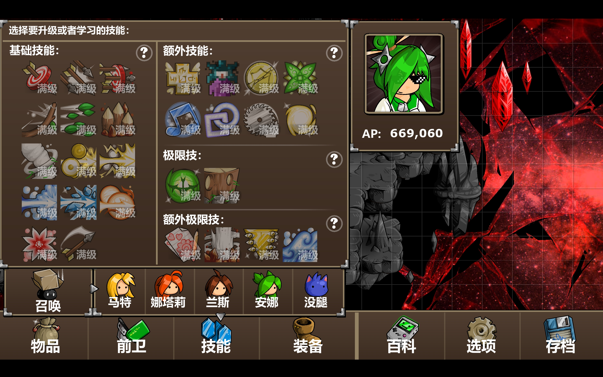
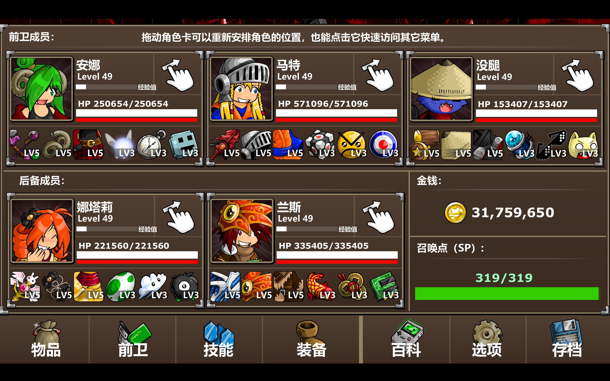
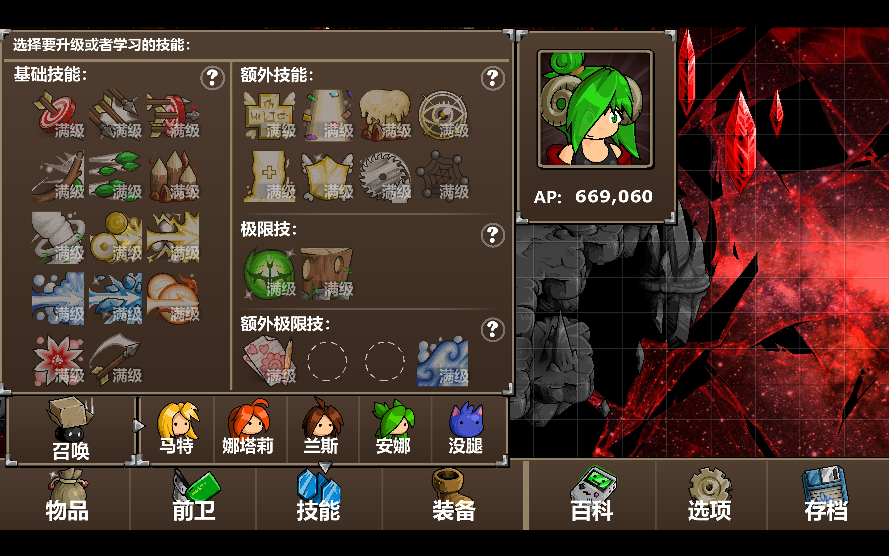
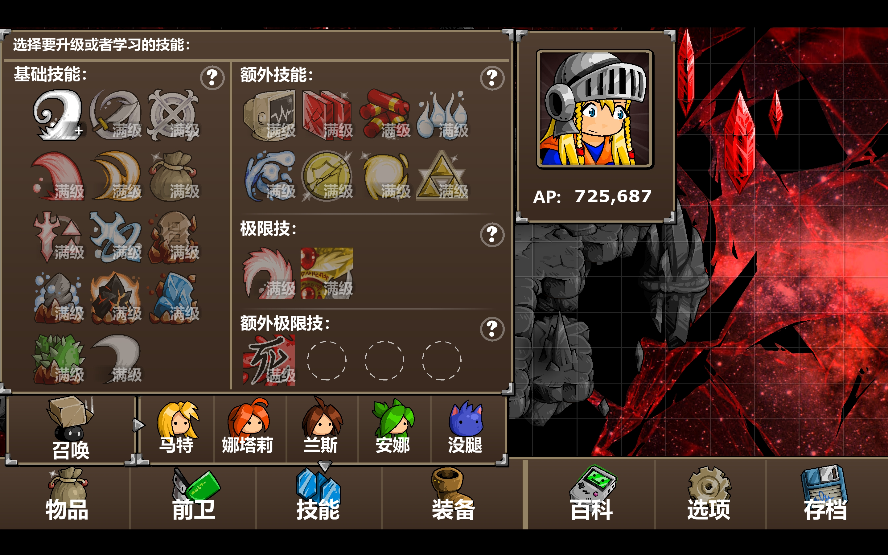
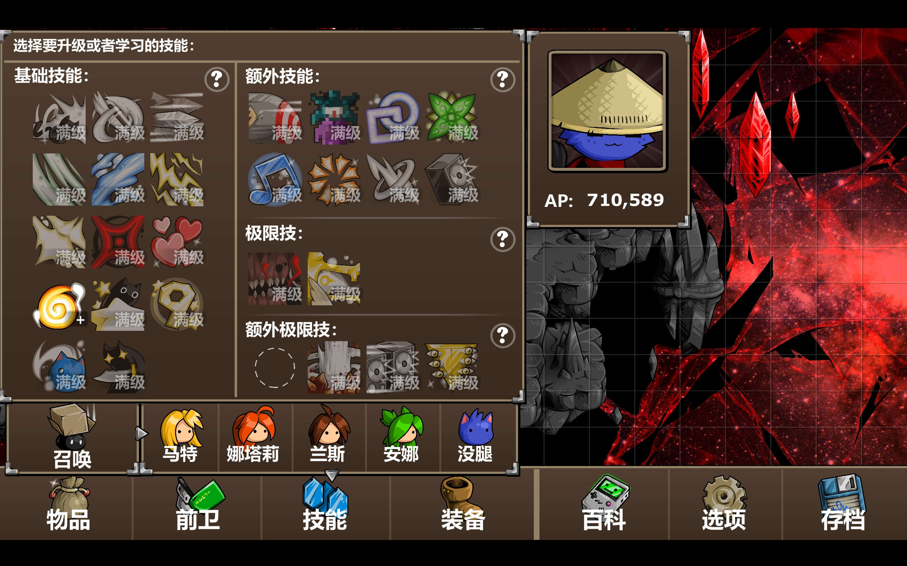
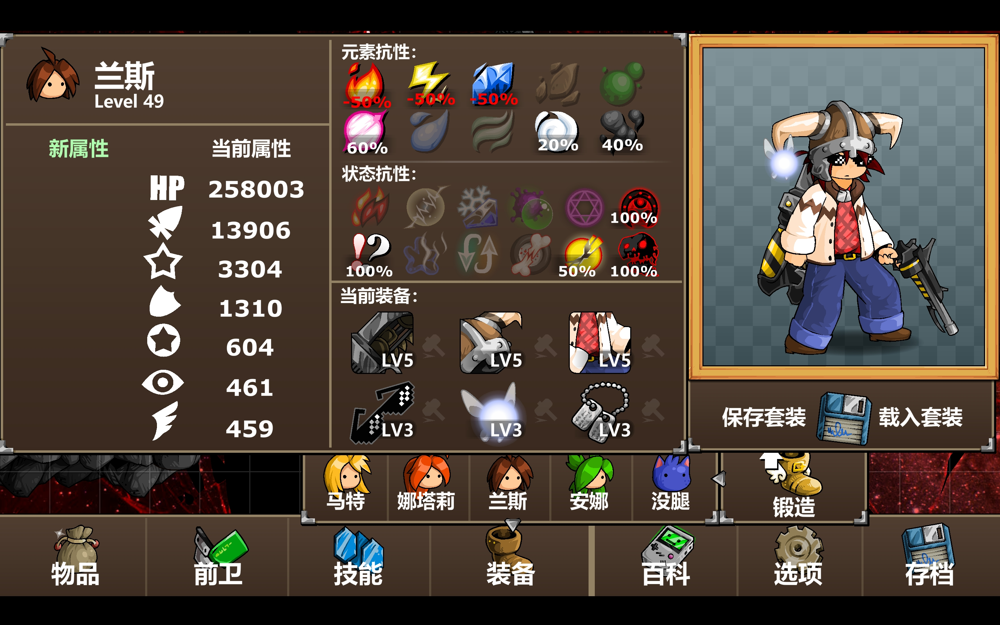

### 基础知识
+ 各类行动的先后顺序
如果角色处于各种状态，例如：再生、中毒、自动复活，装备可以自动触发召唤物，该回合各行动进行的先后顺序，参考 
https://epicbattlefantasy.fandom.com/wiki/Glossary 
【"Between Turns" Effect】版块

+ 命中率
$$R=\frac{己方命中}{敌方闪避} \times 状态影响 \times 技能影响$$
其中 **状态影响** 取决于好运、厄运状态，好运增加25%命中，敌方厄运增加己方10%命中；**技能影响** 取决于各技能的命中率，例如有的技能会写着：命中率较高。
比如：己方命中600，敌方闪避1000，己方有好运，敌方有厄运，使用普通攻击，则命中率为：
$$R=\frac{600}{1000} \times (1+25\%) \times(1+10\%) = 0.825 $$

+ 状态异常添加概率
$$
\begin{aligned} 
R = \ & 技能概率【50\%、100\%、150\%】 \times \\
 & 好运(1+25\%)×厄运(1+25\%) \times \\
 & 武器提升(1+50\%)^{武器数} \times \\
 & 敌方抗性(1-抗性) (个人推测的计算方式) \end{aligned}$$
例如：敌方对冰冻抗性80%，己方技能附加状态120%冰冻，己方有好运状态，穿上两件增加状态异常的衣服，那么用该技能给敌方添加冰冻的概率为：
$$ R = 1.2 \times 1.25 \times 1.5^2 \times 0.2 = 0.675 $$
	> 注：异常状态和减益状态的武器提升概率不同
	>具体可以参考 
https://epicbattlefantasy.fandom.com/wiki/List_of_Equipment_Effects_in_Epic_Battle_Fantasy_5 
【Increases the strength of debuff skills used】和 【Increases the chance of inflicting status effects】版块

+ 暴击率与暴击伤害
增加暴击率的方式：己方勇敢状态（基础几率*2+20）、技能增加暴击率（技能说明）、踉跄状态（必定暴击，增加100%）、好运状态（增加25%）。
暴击造成1.5倍伤害；如果暴击率超过100%，则会造成 **双重暴击**（2倍伤害）；暴击率超过200%，则会造成 **三重暴击**（2.5倍伤害）
具体参考 
https://epicbattlefantasy.fandom.com/wiki/Glossary 【Critical Hit】版块

+ 伤害叠加
如何打出千万伤害？  
削减护甲(×2)，增加攻击力(×2)，攻击弱点属性(×2)，武器增加元素伤害(×1.4)，用威力大的技能(999)，冰冻(×2)，魔隐(×2)，三重暴击(×2.5) 【这些可同时存在】  
伤害计算公式  
[https://tieba.baidu.com/p/6427681544](https://tieba.baidu.com/p/6427681544?pid=130933679424&cid=0#130933679424)

+ 天气存储 
如何改变战斗的前几回合天气为自己需要的天气？
一个漏洞是，通过手动改变天气，然后在敌人的回合结束战斗（依靠反击、自动技能/召唤或持续伤害状态）；这样做，天气效果会在下一场战斗开始时立即生效。
具体参考 
https://epicbattlefantasy.fandom.com/wiki/Glossary 【Weather Storage】版块

+ 装备召唤物触发几率、反击概率、回合间技能触发几率
 具体参考 
https://epicbattlefantasy.fandom.com/wiki/Glossary 
【May unleash X while attacking】、【Randomly casts X between turns】、【Counter-attacks with X】、【Gives the player X status】等 版块

+ 捕捉敌人概率 
	具体参考 
	https://epicbattlefantasy.fandom.com/wiki/Glossary
【Improves chances of catching foes】版块

### 各类状态 
+ 驱散 
驱散各类状态，包括敌方的疾速效果。但无法去掉病毒和属性强弱化。  
+ 高扬 
半血以上保证一滴血存活，且不会受到双防削减。
+ 祝福 
抵消各类负面状态，抵消一次减少一层，即死和殒灭减少2层，驱散减少3层。可以抵消泯灭，驱散，封印，即死，病毒，潮湿，愤怒等，无法抵消雾罩。  
+ 饥饿 
无法被祝福驱散，如果人物已经饱腹，之后被添加饥饿，那么仍然会吃背包里的食物，反之若是先饥饿后饱腹，则不会吃。如果已经饥饿，可以把人物放到后排来防止吃背包里的稀有物品。  
+ 勇敢 
可以免疫暴击并提高暴击率且不会收到双攻削减。  
+ 好运，厄运 
影响命中，施加或被施加状态，捕获成功率，暴击率等。
+ 雾罩 
敌方的雾罩可以用圣元素或风元素攻击驱散，己方则只能用轻盈技能。对于烟雾天气，可以用召唤物来换天气。
> 更多状态详细介绍参考
> https://epicbattlefantasy.fandom.com/wiki/Status_Effects

### 阵容确定与武器、技能搭配
**基本原则**
战斗时队伍包括3个前卫队员，2个后卫队员，前后队员可以轮换。
从阵容组成上来看，3人队伍里面一般都需要有一个吸引仇恨的【坦克】、一个治疗、添加状态的【辅助】，以及一个主力【输出】。但是在战斗中，三者的职能偶尔会有交叉，例如【坦克】也能用食物来群体回血，【输出】也会转移自己的行动机会给【辅助】来调整节奏，总之，战斗时需要灵活根据场面来决定人物的行动。

5个角色中，判断谁来担任何种类型的职业，主要是根据**角色的武器**决定的，其次考虑该角色的**基础属性**以及**可学习的技能**。
+ 坦克
武器要求：高血量、高防御、高闪避之一
基础属性：高血量、高闪避之一
可学习的技能：无要求

+ 辅助
武器要求：有属性强化弱化装备、武器可以添合适的负面效果
基础属性：无
可学习的技能：转移回合数、群体回血、添加debuff的技能等

+ 输出
武器要求：高攻击
基础属性：高攻击
可学习的技能：各类元素技能、强力极限技

由于【普通模式】和【定制模式】的装备能力不一样，所以两种模式的人物可能会承担不同的职业。
例如在【存档4】的【普通模式】中：马特是 **主力坦克** 兼 **物理输出**、没腿是**主力辅助**、娜塔莉是**次要辅助**  兼 **魔法输出**；而在【存档2】的【定制模式】中：马特是 **主力辅助**、没腿是 **主力坦克**、安娜是 **主力输出**。
个人觉得【定制模式】的装备上限更高，因此下面主要分析【定制模式】的阵容构建思路和装备、技能搭配。

**阵容构建思路**
攻击分为物理、魔法攻击，往往为了增加伤害会需要降低敌人的物防或者魔防，如果同时需要降低两种防御，那么会额外增加操作量，因此最好只需要对敌人降低一种防御（诅咒可以同时降低双防，但是绝大多数boss免疫）。

根据角色的初始技能以及基础属性，分为 **物理组**：马特、安娜；**魔法组**：娜塔莉、兰斯；**特殊组**：没腿。其中物理组的角色还有一个优势在于，可以群体添加武器的附属状态，例如：马特的旋风斩、安娜的箭雨，以及没腿的迅斩。利用这些群体攻击，配上合适的武器，可以很容易的上群体debuff。因此前卫队员更建议用物理组。

**推荐阵容**
**阵容1（主流）：**
坦克：没腿（超高闪避）
辅助：马特（群体降物防且增加debuff效果的武器）
输出：安娜（超高物攻）

队伍:
 
之所以这么排序是因为：
 1. 安娜有眼镜，防止0血暴毙，因此需要放在最后，可以让前面的队友帮助回血。
 2. 没腿没有混乱抵抗、放在第一个位置被混乱了就会浪费一次行动机会，所以放在第二位。

马特技能：

 说明：由于马特三件装备都具有【增加弱化强度】的作用，所以尽可能给他削减对面状态的技能，例如：降物防、降闪避、降命中。此外，马特装备还可以【增加状态异常】概率，所以选择给敌方厄运、驱散、封印、麻痹这些负面效果的技能。

没腿技能：

 说明：由于没腿装备具有【增加属性强化】的作用，所以给他添加己方增益的技能，例如：增加双防、增加闪避、增加命中。此外，没腿的技能冷却都很长，所以会需要装备【纳米机械】来降cd，所以会给它【锐化】这个cd长而且最常用的技能。没腿的装备还可以【增加道具强化】、【增加道具治疗】，所以也可以选择用道具来给己方群体回血以及增加攻击闪避等。

安娜技能：

 说明：由于安娜装备增加物防很高，而且【增加无元素技能】威力，所以她当输出，给的技能都是攻击性的无元素技能。此外，也可以让安娜偶尔给群体回血以及群体清除debuff等。

战斗流程：
 1. 马特防御一回合吸引敌方仇恨（这时不用没腿是因为己方buff没叠起来，没腿血量太低容易暴毙，所以用马特先抗一回合）
2. 没腿【九命猫】添加群体复活
3. 安娜召唤【维京石碑】增加己方每人一次行动
4. 安娜使用【Phyrnna的守护】添加群体再生
5. 没腿召唤【桩木黏黏怪】添加群体高扬（也可以用没腿的极限技【死亡金属】，但是太浪费了）
6. 马特丢【鞭炮】技能，添加群体好运
下个回合，己方还需要进行群体回血、添加【祝福】、【勇敢】状态，增加群体回避、没腿放【锐化】、没腿防御吸引仇恨等。这些内容操作与否取决于己方可行动次数，回合间是否触发【急速】状态等。优先程度是锐化必须做，其次是回血 > 加闪避 > 加祝福 > 没腿防御 > 加勇敢。
等补全buff后，后面只需要用锐化不停的维持buff即可（需要偶尔给没腿投喂食物来降cd，薯片、苹果都可以）。之后就是给己方增加双防、命中、攻击力来回操作，准备打输出。
对于给敌方debuff，优先给【厄运、疲劳、诅咒】这三个，其中马特直接用旋风斩配合武器就可以降80物防（不算敌方抗性）添加**诅咒**后可以始终维持敌方物防低水平状态；**厄运**最好是用召唤物【骷髅猫】；**疲劳**则用安娜的【大地开花】技能（但这是个魔法攻击，伤害不高）。
值得一提的是，兰斯的武器【水晶之翼】可以直接给敌方添加【魔隐】状态，这个可以让安娜攻击加倍，所以会有时让兰斯和马特互换位置，因此马特可以用装备【Viridian舰长】来保存行动到下回合，然后添加完debuff后换成兰斯给敌人魔隐，安娜再来蓄力一击。
总的来说，就是维持己方buff，回血，添加敌方debuff，打伤害来回操作的过程。
但有时候敌方攻击太猛了，很难维持住己方满血满buff，甚至有时候连复活状态都没有。所以三个人里面，优先保住没腿复活状态，其次是马特，最后是安娜。由于安娜这种容易死亡的特点，因此需要【像素墨镜】、【吵闹妖精】保生存，【狗牌】来免去己方辅助给安娜物攻加成的额外行动。

阵容的优势：
1. 最大的优势就是没腿闪避很高，所以【标靶】状态很难被去掉（敌方命中一次少一次）。因此没腿可以只用每两回合防御一次，在当坦克的同时有额外的行动来当辅助。
2. 安娜的攻击很高，以及装备反击概率很高。对于敌方群体aoe，标靶状态则无法吸引，此时己方所有人员都会受到伤害，因此肯定会需要一个额外的群体回血操作，从而少了一次攻击机会。反击概率高则可以弥补这次失去的攻击次数，对敌方造成额外伤害。
3. 马特的额外30%属性弱化效果且具有基础削减50护甲的装备。 
4. 兰斯的装备自带【魔隐】，除了【数据中心】的前代怪会免疫，其他怪均不免疫，从而增加了每次伤害的上限。
___
**阵容2：**
坦克：马特（超高血量）
辅助：安娜（额外行动次数）
输出：没腿（强大召唤物）

队伍:
 

安娜技能：

马特技能：

没腿技能：

战斗流程：
这个阵容的战斗流程实际上和阵容1类似，不过需要多一个额外操作：替换天气。因为马特的武器会给灼烧状态，每回合大量造成伤害之余还会削减HP，是一个很麻烦的debuff，如果每回合都去清除会很浪费行动次数，所以直接把天气替换成**下雨**，这样回合间就会给予潮湿去掉灼烧状态。（这种天气也适合处理己方狂暴的负面状态）

阵容的优劣：
**优**：优势在于没腿可能回合间召唤【猫神】，很厉害的召唤物，不削减敌方魔防的情况下，基本上群体每人造成100-200w伤害，很适合清小怪，但是太难触发了。还有一点是没腿的装备带有100%麻痹效果，所以可以群体麻痹。
**劣**：但是这套阵容伤害不如上一套；而且血量坦克不如闪避坦克抗压能力强，需要经常防御浪费回合数；没腿还需要偶尔放锐化，导致不能安心输出，各成员放技能的节奏不太规律。

___
其他阵容也可以类似根据人物的装备进行调整，例如如果人物有很多【急速】装备，那么可以适合当辅助；高额伤害加成则当输出。
例如：另一种输出搭配则是利用兰斯的【链条枪】，在阵容一的基础上，把输出的安娜换成兰斯，坦克和辅助不变。核心思路是利用兰斯的【子弹齐发】技能打伤害（因为威力较高，不过冷却很长，所以需要薯片降cd或者配合其他物理攻击打伤害）。此外兰斯的【溃甲】具有高驱散的作用，冷却低，也很常用。但缺点在于兰斯没有带元素的物理攻击，所以全面性不如安娜，不过如果用【子弹齐发】伤害也差不太多，当然因为用【链条枪】当武器，那么没办法给敌方添加【魔隐】状态，所以上限不如阵容一。下面是兰斯的武器搭配，技能搭配直接照搬阵容一安娜的技能即可：

**怪物图鉴**
具体参考 
https://epicbattlefantasy.fandom.com/wiki/List_of_Foes_in_Epic_Battle_Fantasy_5 
在图鉴中可以看到每个怪物的技能招式，攻击规则，弱点属性，基础数值等。

### 特殊敌人的打法
有的敌人不免疫病毒，利用这点可以只需要防守，不用进攻，利用病毒来不断的耗敌人血量即可。
> 比起灼烧、中毒，病毒不会掉层数，还会不停的在敌人间传播，但需要防止传播到己方成员，可以用【祝福】来阻挡，或者给队员穿戴毒抗超过100%的装备）

但需要注意有的敌人不免疫病毒，但毒抗达到150%，此时添加病毒反而会给敌方回血。这类敌人有时候还会给自己添加病毒，去除敌方病毒的方式是利用技能【净化】。

各boss的技能介绍参考上面的【怪物图鉴】。

**街机boss**
+ 凤凰、蛇
	特点介绍：这两个怪的特点都是会复活，闪避高，如果只打死一只而不打死其他的，活着的怪在行动时就会召唤一只新的怪。此外凤凰行动后还会给自己添加自动复活，每次行动吐一堆音符，会很快消耗掉坦克的【标靶】状态。

	打法：对凤凰可以麻痹或者冰冻，但抗性较高，最好是用封印，这样不会自动复活，也不会复活队友。
	对蛇可以封印，也可以尝试控血量最后一回合群杀。

+ 捷克
	特点介绍：不被攻击时伤害低，防御低；被攻击后变【愤怒】（反击也算）伤害高，防御高。可以用水元素技能攻击来驱散愤怒。boss具有群体降闪避的技能，而且怪的数量较多，可能给自己添加可爱状态。
	
	打法：一只只的打，最好在未愤怒时防御较低的情况下打，然后用水元素技能驱散愤怒。可以封印技能。

+ 桩
	特点介绍：防御低但血量高，会使用给予一堆负面效果的技能（包含混乱、雾罩等），有降低己方闪避的群体技能。会给自身病毒来回血。怪的数量比较多。
	
	打法：速攻打法，可以用祝福来抵挡负面效果，但一般很快层数就没了，用没腿闪避来躲避攻击效果较好。如果被添加负面效果了，除非混乱麻痹之类，其他的就不要浪费行动清除掉，直接去攻击敌人，尽可能先打死几只。可以封印技能
	
+ 图腾
	特点介绍：血量较高，根据血量分为3个阶段。阶段1比较普通，阶段2攻击次数变多，阶段3受到任意攻击时都会自动回血并添加3层祝福。能使用降低闪避的技能，可以给自身可爱效果。打死一只后，另一只血量低会逃跑。
	
	打法：3阶段后不要轻易攻击图腾，要集中火力来打，不然造成的伤害可能还没有回的血量多。
	
+ 虎箱
	特点介绍：免疫几乎所有负面状态，但是不免疫病毒。技能伤害高，而且会吐一堆宝石给予各种负面效果，会很快消耗【标靶】层数。物理防御高，血量低时会给自身可爱状态且无法驱散。怪的数量比较多。
	
	打法：用病毒来磨血，然后己方维持住续航的方式可行。或者用没腿来闪避攻击，这样不会快速消耗【标靶】，然后输出逐个击败。
	> 注意血量低时，虎箱命中率会变高，所以没腿可能会闪避不了攻击。因此最好是按照行动顺序，从后往前来逐个打虎箱，这样即使最后一只虎箱打死了没腿，没腿自动复活后，后面也没有怪再造成伤害。
	
+ 牙齿
	特点介绍：必定三倍暴击，除非给予勇敢状态。每次行动会群体aoe一次，然后再单体攻击两次。有两次血量降到临界值时会再额外群体攻击一次，并给自己添加病毒回血。
	
	打法：给自己添加勇敢，或者用高扬状态守住1滴血，保证每回合回血后成员血量过半即可。注意清除牙齿身上的病毒效果防止回血。
	
**主、支线boss**
+ 雪花

+ 泰尔佩瑞安

+ 波塞冬和伏尔甘

+ 吞噬者

**试炼神殿**
+ 马特
	负面效果：无法使用极限技且必须在15回合内结束战斗
	
	特点介绍：人物免疫几乎所有负面效果与属性衰减（无法降低魔防、物防，最多只能降命中和闪避）。血量减半后会吃一次补品回少量血，之后会偶尔给自己防御状态且增加80的物防并添加勇敢。
	
	打法：boss不免疫病毒，可以用病毒磨血，但伤害不太够，还需要打额外的伤害。对于boss半血后给自身80物防，可以选择驱散，也可以用召唤物【红色飞行器】进行反转。对于boss免疫80双防，可以尝试把天气变成【辐射】，这样偶尔会降25双防（由于无法使用极限技，所以没办法用兰斯大招把天气变成【辐射】，可以用【天气存储】的技巧来实现）

+ 娜塔莉
	负面效果：技能、再生无法回血，自动复活也变成0血
	
	特点介绍：人物魔防很高，而且会召唤己方成员的巫毒。有80魔防抗性，会给自己添加可爱状态。
	
	打法：召唤物和食物可以回血。主要用物理技能攻击，并且记得封印巫毒防止反伤己方成员。
	
+ 兰斯
	负面效果：无法召唤生物且武器的召唤物也不会出现
	
	特点介绍：高物防且具有80物防抗性，免疫几乎所有负面效果，且免疫病毒。技能多为群体aoe。死后会自爆，造成大量伤害。
	
	打法：最好用法术技能攻击，如果用物理攻击只能一点点的伤害去磨。由于开局无法召唤维京石碑，所以前期比较难叠状态。记得清理各类导弹，防止造成二次伤害。

+ 安娜
	负面效果：所有属性强化全部变成属性弱化
	
	特点介绍：人物会频繁放大招，普通招数通常为单体的多段攻击，所以会容易清除【标靶】状态。
	
	打法：注意不要上属性加成，只添加buff即可。然后自动复活后给予属性加成的装备，例如：同伴方、狗牌等，要慎重选择。比较难捕捉，建议降低难度后再捉。
	
+ 猫神
	正面效果：每回合给予各类属性加成，最高100。
	
	特点介绍：
	1. 猫神血量高，伤害高，闪避高。没有元素弱点，前期会有异常状态弱点，中后期各类抗性均会提升。
	2. 血量降低后会吃补品，消除负面debuff且增加100双攻（但不会消除厄运状态），并且每次行动的攻击次数会增多，到后期可能一次攻击锤14下，有时候没腿都可能闪避不了某几锤被锤死（会很快消耗【标靶】，打死一个人后会转移目标）。
	3. 各阶段会蓄力一回合并释放强力的大招，多段伤害，所以可能高扬和自动复活都无法抗住（但没腿比较容易闪避）。还会经常放【群星爆闪】驱散我方所有状态，因此需要给成员穿100%防驱散的装备。
	4. 召唤的小猫命中率较高，经常戳死没腿。
	
	打法：boss不免疫病毒，可以用病毒磨血，但伤害不太够，还需要打额外的伤害。对于boss半血后给自身80物防，可以选择驱散，也可以用召唤物【红色飞行器】进行反转。对于boss免疫80双防，可以尝试把天气变成【辐射】，这样偶尔会降25双防（由于无法使用极限技，所以没办法用兰斯大招把天气变成【辐射】，可以用【天气存储】的技巧来实现）

**小怪**
+ 像素怪
特点介绍：闪避很高，且吸收各类元素攻击，只能用无元素攻击。物防和魔防二者有一个为负值，有一个为2，随机出现。伤害必中且几乎无限大，并会带有随机元素属性，所以如果己方该元素抗性超过100%，会给己方回血。
	
	打法：一定要一回合打死。先看物防和魔防哪个是正值，如果是物防为正，那就用任意的无元素的物理攻击；魔防为正，那就用没腿的【群星爆闪】技能（无元素的魔法攻击并不多，只有娜塔莉的【幸运星】和这个技能，而【幸运星】伤害低，打不死敌人）。
	> 记得给敌人降闪避或者增加己方命中

+ 各类导弹
	特点介绍：不会主动攻击角色，冷却2到3会合后，会释放导弹造成巨额伤害，但该伤害可以闪避。如果麻痹或者冰冻敌人后，冷却回合会按回合数顺延。
	
	打法：添加封印状态，这样到释放导弹回合会自动投降。

### 前、中期玩法
建议在前期都采用【零蛋】模式来抓怪、过主线，原因是在没有到达绿木村的时候，是没有【目标徽章】或者【愤怒表情】来提供**标靶**状态的，所以没有人物吸引仇恨，只能用没腿的可爱来转移仇恨。
前期优先选择升级**没腿**的【九命猫】、【暮光探戈】（诅咒降双防）、【群星爆闪】。
升级**马特**的【锻炼】、【传奇】。
其他角色随意。

前期最好用一件可以给予敌方【战斗不能】状态的武器，例如：冰冻、麻痹等。比如用没腿的【法术之书】，50%2回合冰冻，配上【增加异常状态】的衣帽以及好运厄运状态，使用【迅斩】技能，往往可以群控对面，之后再一个个的解决敌人。如果有单位没有被控，那么就用安娜放箭再控一次（根据敌方抗性选择麻痹还是冰冻）。

厄运+殒灭=即死。另一种方式则是先放鞭炮群体厄运，然后用一个带有殒灭状态的装备群攻，可以快速解决一般的小怪、建筑物等。但需要注意，这种方式最好在作弊选项中添加【己方先动】，因为很容易把一回合对面全部带走后，第二波开始是敌方的回合，如果己方防御环节没做好，例如没有自动复活，没有一些buff等，容易导致人物死亡。

​
### 小经验
+ 如何提高装备的技能触发概率(例如：维京石碑)
好运状态​、喵喵挂件 
	>具体参考：
https://epicbattlefantasy.fandom.com/wiki/Glossary 
【Randomly casts X between turns】版块
 
+ 祝福状态可以免疫绝大多数负面效果，但不能免疫雾罩  
常规双攻双防、命中闪避最多加减80，例如敌人有50防御抵抗，添加疲劳效果后，最多减至30

+ 对于强敌有高攻高防的强化，而且50免疫驱散，可以给予敌方厄运和己方好运提高驱散率  
如果是100免疫驱散，可用红色飞行器进行反转。  

+ 对于强敌有80物防抗性时，无法使用一般的削弱法术来削减物防，可以用辐射天气，有概率直接削减敌方25物防

+ 封印：可以让导弹类敌人投降，凤凰无法自动复活

+ 兰斯武器【加速器】的技能1：减速，在使用普攻、二连弹和子弹齐发技能时，100%麻痹对手，但会被麻痹抵抗所抵消（【普通模式】武器）

+ 偷敌人物品：每场战斗每个敌人只能偷一次，可以逃跑后重新开战反复偷。只能偷材料，稀有物品例如：辣椒、披萨、增加属性的食材都无法偷取。(如果想刷这些稀有物品，可以通过打败boss后拾取，但保留某个召唤物，之后逃跑退出重打此场战斗)

+ 每次逃跑之后重新战斗，技能冷却会减少2回合。可以先扫描对面弱点后逃跑，然后再战斗。  

+ 特定节日的物品掉落和击败的怪物难易程度有关，大怪一般会掉落多个，而小怪则不掉落。这些节日物品会用来升级该节日匹配的装备，如果想刷物品，可以找一个有boss的关卡，然后先击败大怪而保留小怪，然后逃跑，反复刷关。

+ 对于一些生物，例如大象打死后会使人物饥饿，可以用捕捉的方式，这样就不会算击杀导致饥饿。  

+ 防止巫毒对角色造成伤害，可以用封印，捕捉。

+ 锐化会延长饥饿饱腹时间，净化可以清除敌方负面状态(病毒，厄运等)  

+ 对于给负面状态的装备，例如厄运，可以把人物放在后面防止厄运，对于狂暴或者灼烧，可以换成下雨天气，如果有勇敢可以给踉跄  

+ 怎样快速刷sp？ 
	地狱模式+回sp装备
	> 【作弊选项】中的地狱模式需要解锁（可能是通关5场试炼神殿的星星勋章挑战），

+ 在星星挑战限时模式中，如果开启地狱模式，敌方麻痹9回合，如果己方不采取任何行动，到第9回合时，猫咪(也可能和装备，人物位置有关)有概率可以一回合7动，也就是叠加的急速层数不清空而且每回合稳定加1，但其他人物则会层数不增不减。  

+ 如何不停地刷蒸馏咖啡和果汁？
 圣诞节任务和复活节任务奖励会给蒸馏咖啡和果汁，可以通过修改日期反复接取这些任务实现刷物资。

+  记得利用食物
	回血类的食物：通常都是用群体回血的云莓以及单体的西瓜。
	减cd的食物：苹果和薯片。
	清除己方弱化：香蕉或者饼干圈。
	属性强化：物、魔攻，命中、闪避、最大HP（果汁）
	复活人物：咖啡
	填充极限技：辣椒

+ 如何清除己方属性弱化
属性强化进行覆盖、技能【驱散】、红色飞行器反转、食物香蕉

### 战斗攻略（他人版）
无尽战斗80波受苦记  
[https://tieba.baidu.com/p/6516703139](https://tieba.baidu.com/p/6516703139?pid=130294535587&cid=0#130294535587)  
适用大部分史诗星级成就的无脑打法  
[https://tieba.baidu.com/p/9662349235](https://tieba.baidu.com/p/9662349235?pid=151997225960&cid=0#151997225960)  
召唤怪物推荐  
[https://tieba.baidu.com/p/7759199105](https://tieba.baidu.com/p/7759199105)  

<!--stackedit_data:
eyJoaXN0b3J5IjpbNjE5MzE3Nzc3LC0xNjIwODkxMTUsMjA5OT
k1MTc3MSwtMjA0MjYzOTY3OSwyMDUxMzczNjg5LC0xNDg1ODE5
MzU5LDEzNzQ2ODM4MzEsLTE5MTU1NzAxMzgsODkxMTE5NTc2LD
ExMTQ5NTQxNDMsLTYwOTUyNjM5NSwxMjU1Njc4MzYsLTIwNjUw
MzcwMTBdfQ==
-->