 说明：图片来源均是【盖伊传说吧】中找来的

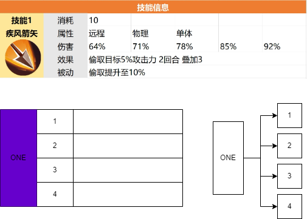

对内容的整理归纳，通常采用的是：**列表**或者**表格**的方式。

### 方式
下面的几简历都是通过展示容的。
使用简历主要针对内容较多的情形，有时候一张表很难排全，而且只是针对单一个体的内容，所以不建议用表格。

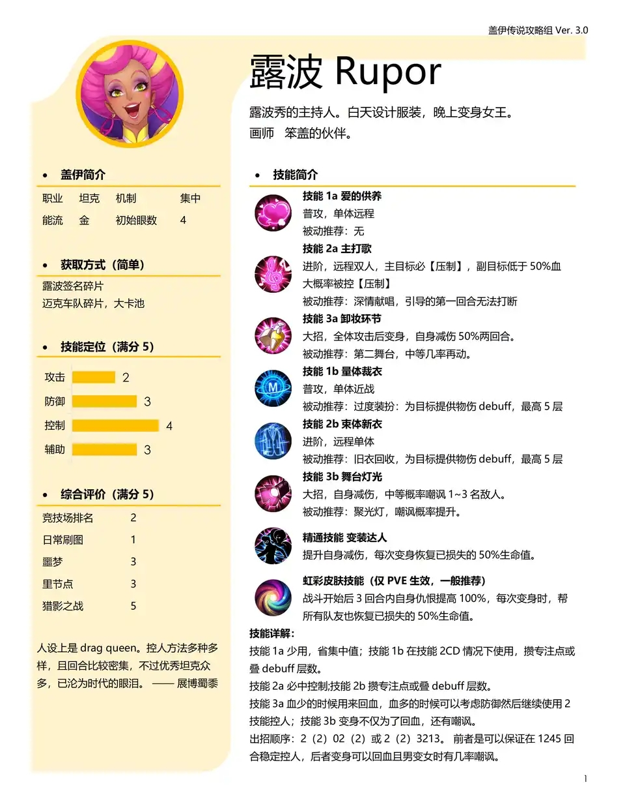

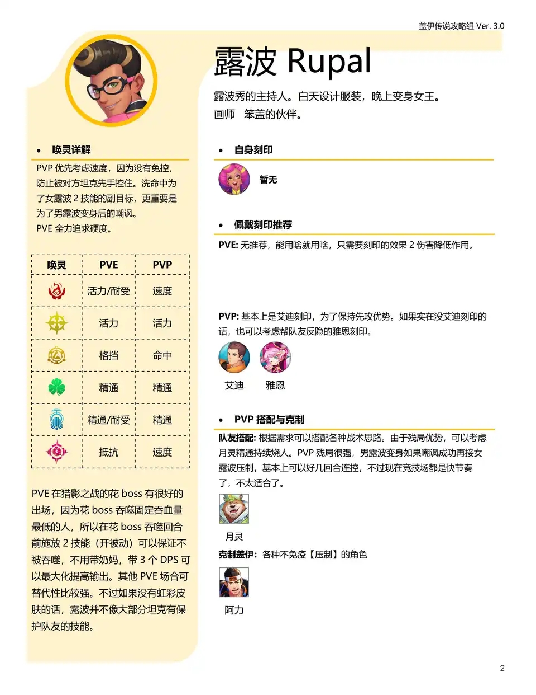

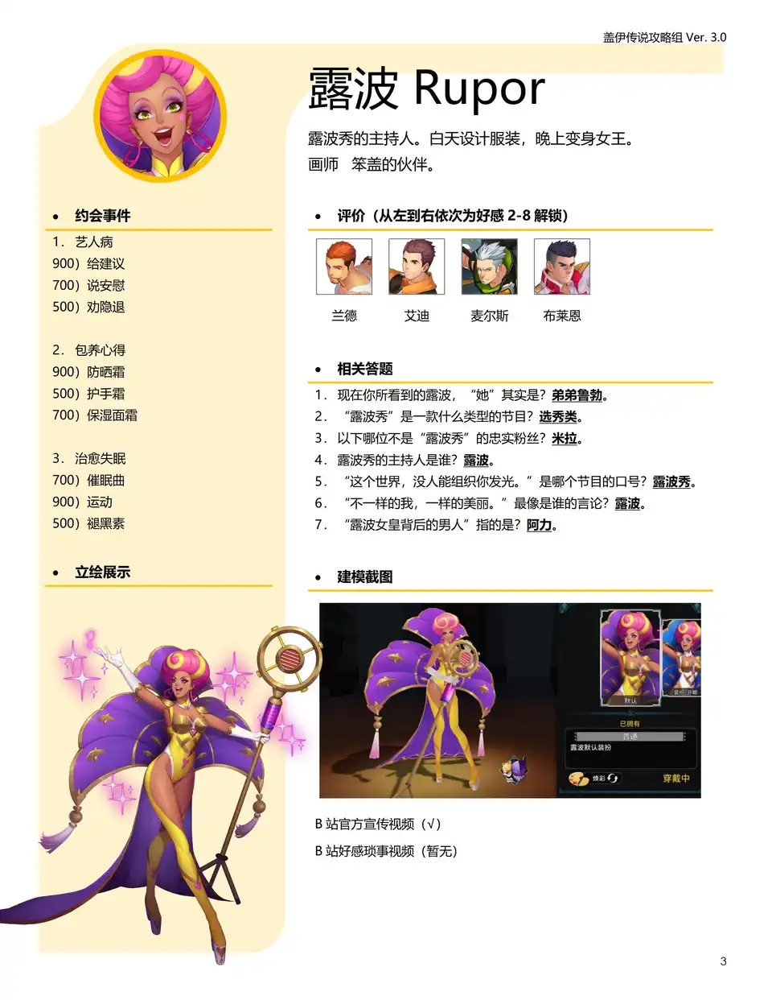

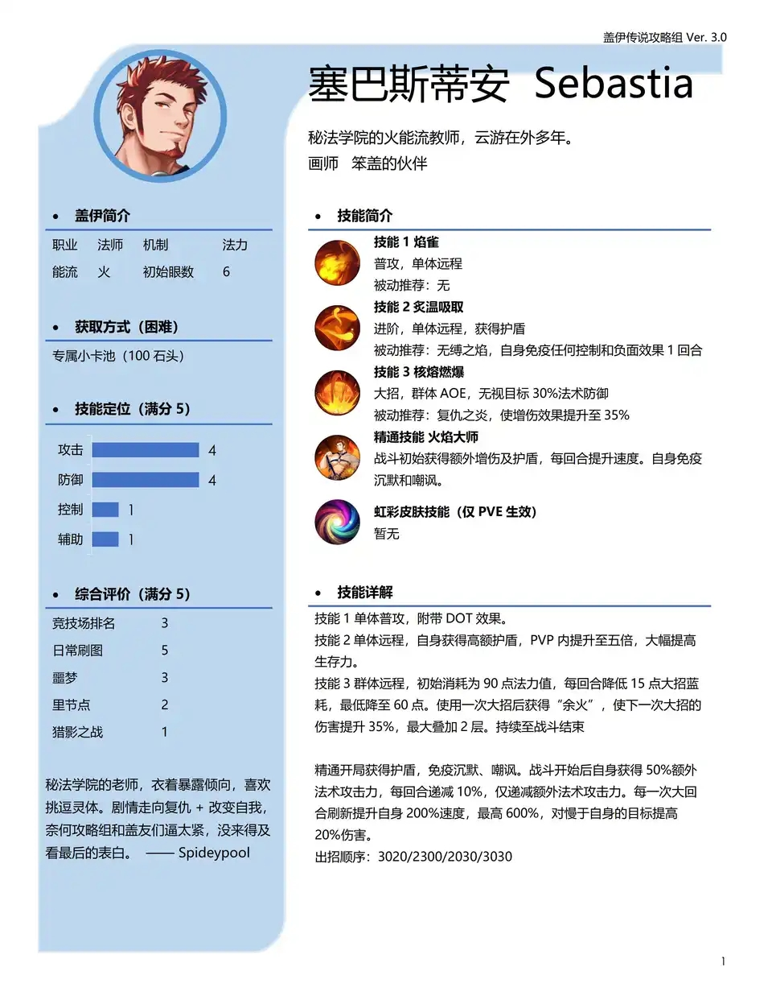

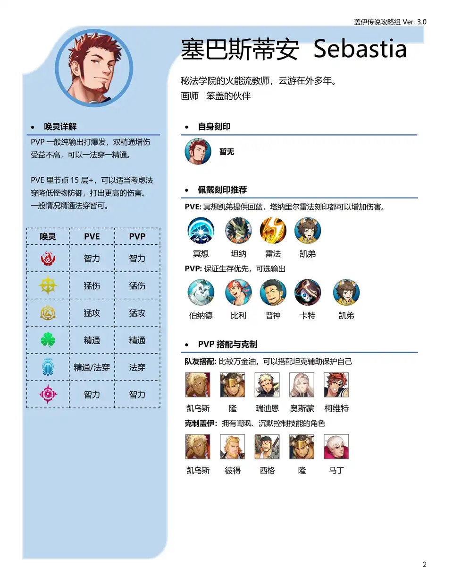

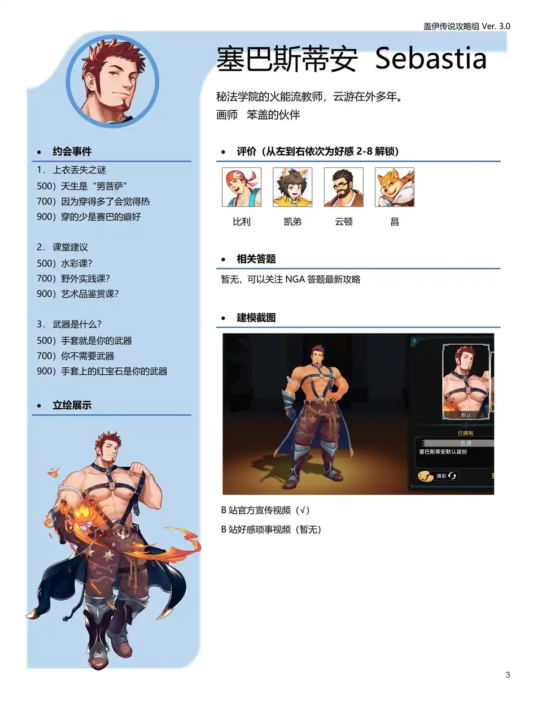

关于简历的制作技巧，目前还未探索。

### 表格方式
#### 绘制表格的工具
通常是使用Excel的方式，通过合并单元格、颜色填充、分配区域所占的格子数、插入图片等方式，可以绘制比较华丽的表格，如下面的例子：

#### 表格的种类
个人感觉表格可以分为两类：流程图型表、矩阵型表。
+ **流程图型表** 
	这种表在结构上可以拆成流程图的形式，例如：
	横版：
	

	竖版：
	
	
	下面这个简历就基本上是由流程图型表构成的：
	

	

+ **矩阵型表**
	这种表格就是很常见的表格形式，如矩阵一样，横纵排列。
	

+ **两种表格的比较**
	流程图型表的特点是，只能针对单一对象的内容。所以有以下优劣：
	+ 优点1：可以允许不同对象所包含的内容不一致。
	  > 例如：下图的技能1和技能2，两者包含的条目是不一样的
	  > 
	  
	+ 优点2：适合对象少，但内容多的类型。
		> 例如：上例中只有3个对象，但包含了7-9个不等的条目，因此如果绘制成矩阵型表，那么会需要 $3\times 9$ 的表格，比较狭长不美观。
		>
		>	而且有的条目包含内容很多，如果用一行展示，则该单元格会很长，也许会导致表格超出页面；如果多行展示，对那些很少内容的单元格，则会显得空白太多。因此最好使用灵活性较高的流程图表。
	
	+ 缺点1：无法比较不同对象之间同一内容的区别。
		> 因为表格是对象之间相互独立排列的，所以不如矩阵型表一目了然。
	
	+ 缺点2：不适合对象多内容少的情形	
		> 因为流程图型表是针对单一对象的，所以对象多，意味着长度大、内容少，意味着宽度窄，因此也是一种狭长的形状，尽可能避免。

	所以**少对象、多条目**的表格适合流程图表：
	
	
	
	
	而**多对象，少条目**或**需要对比**的适合矩阵型表：
	

	
	
	对于**少对象、少条目**的可以把它们用流程图表拼起来：
	

	对于**多对象、多条目**的可以把它们用分成几个矩阵表拼起来，或者用流程图表制作成简历的样式：
	
	
	

	
	
	有一些表，既可以用流程图表，也可以用矩阵表，例如：
	
	这个表实际上可以分成4个流程图表，效果应该也不错，形如：
	
#### 表格绘制的高级技巧
+ **表格的嵌套**
+ **表格的长宽比例选择**
+ **颜色的合理运用**
+ **其他细节**	

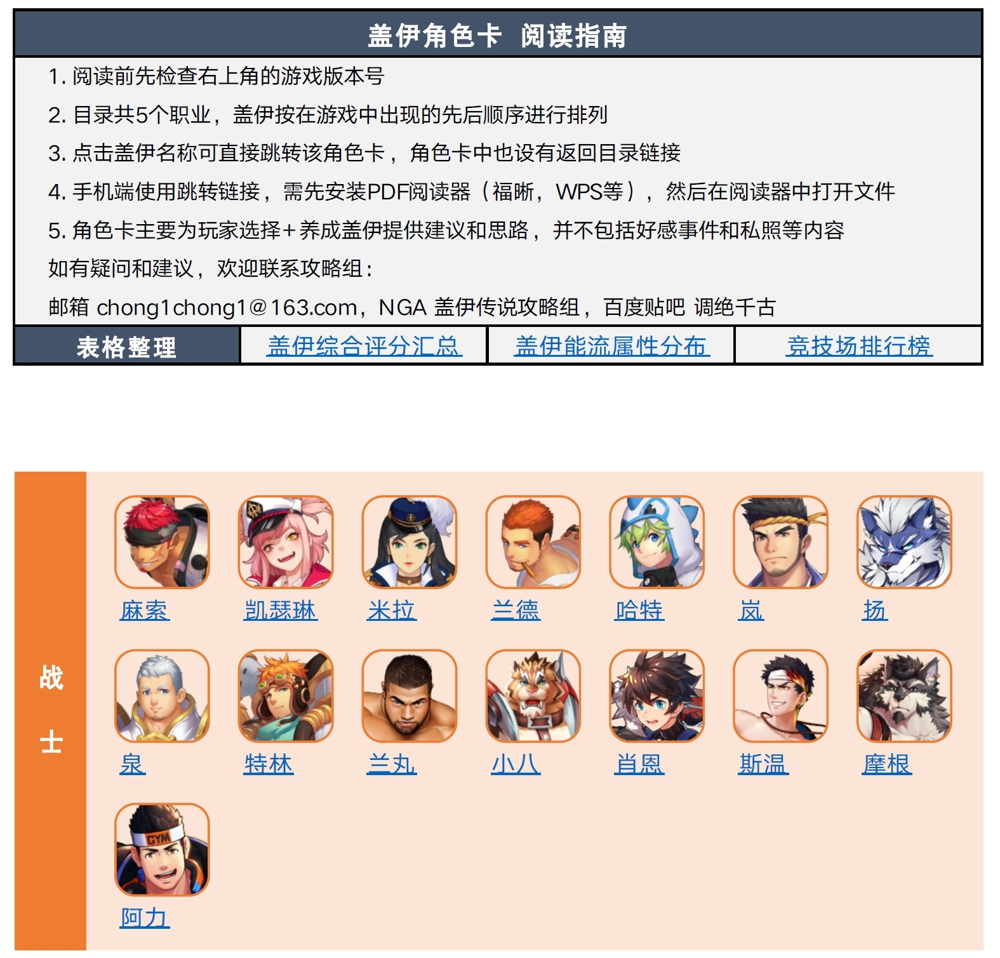

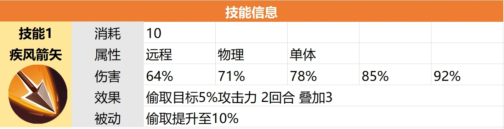

 

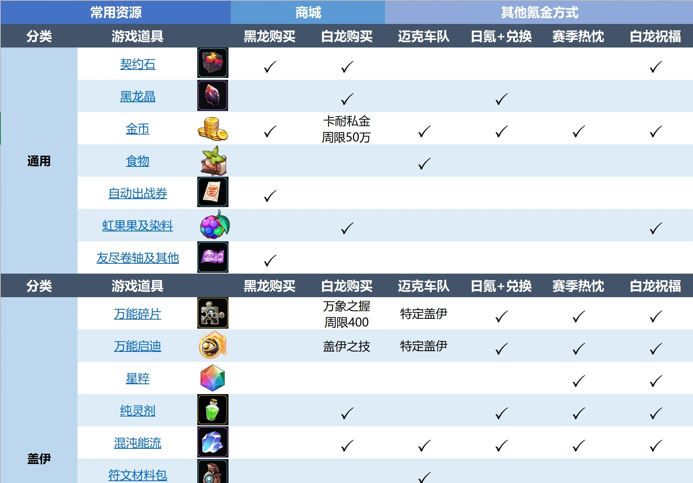

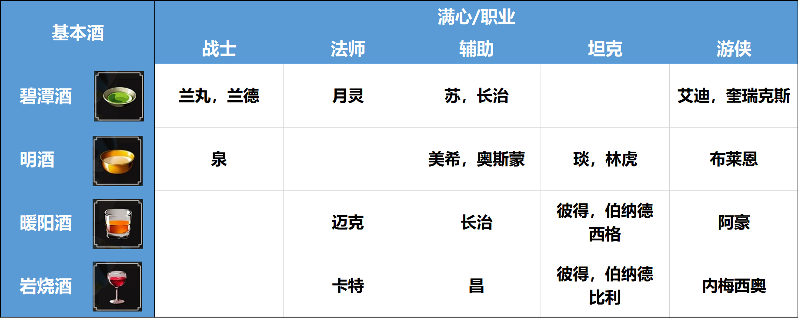

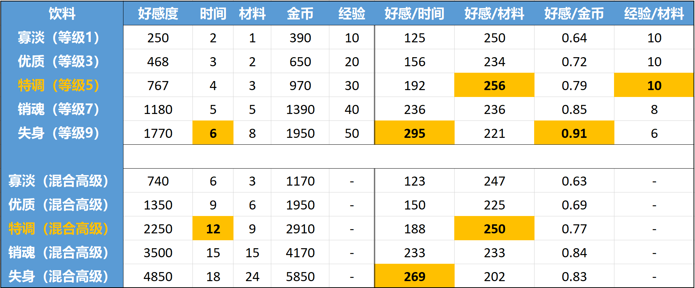

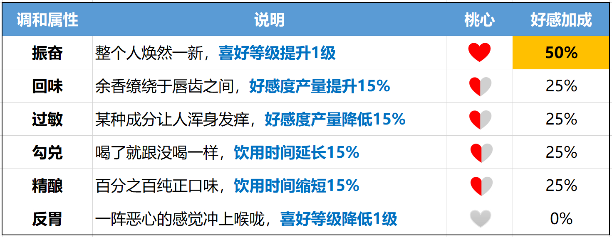

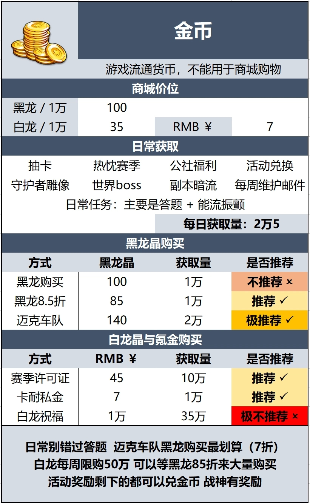

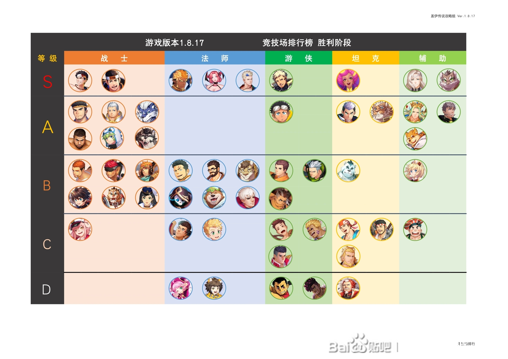

<!--stackedit_data:
eyJoaXN0b3J5IjpbLTEzMzQzODc2MjMsMzAzNzc0NTk2LC0xMz
M4Nzc2MTQyLDE0NjMyMDAzMDEsMjAwNDI1NjgyMywxOTc1NTgx
MjMyLDE2MDQ3MDU1ODMsMTc1MzU3MjY2NywtMTQ2MzI1MzY5NS
wxNTc3MzgzNzcwLC0xNDYzMjUzNjk1XX0=
-->